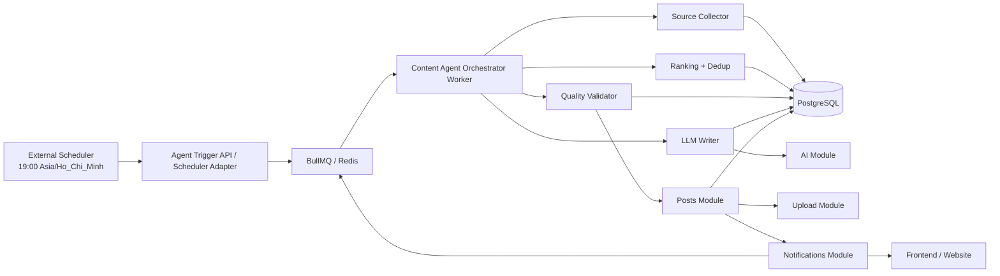
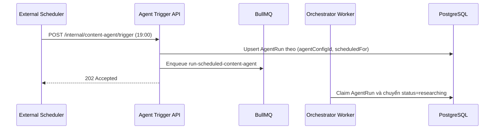
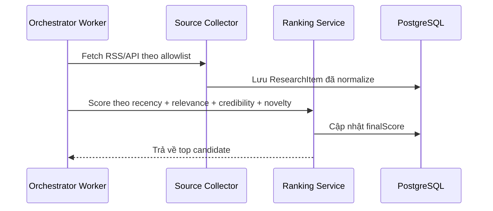
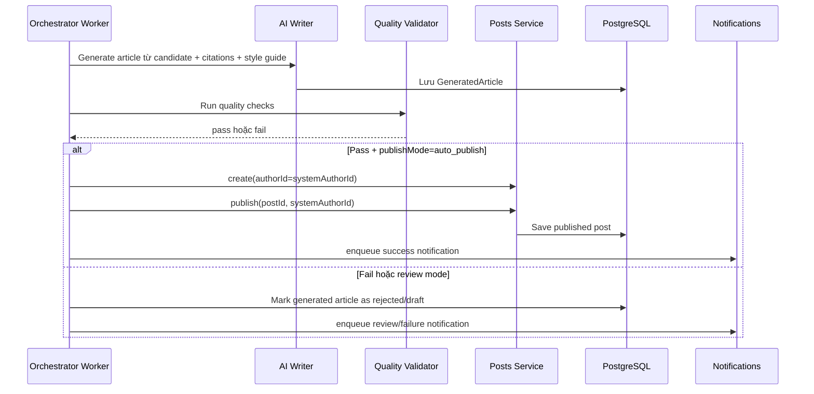

# System Design: AI Agent tự động research bài mới nhất lúc 19:00 và tự động đăng bài lên website

## 1. Mục tiêu

Thiết kế một tính năng cho phép hệ thống tự vận hành như một "AI content agent" với lịch chạy cố định lúc `19:00` mỗi ngày theo múi giờ cấu hình, mặc định là `Asia/Ho_Chi_Minh`.

Khi đến giờ chạy, agent sẽ:

- thu thập các nguồn tin mới nhất theo topic đã cấu hình,
- đánh giá và chọn các bài phù hợp nhất,
- tổng hợp thành một bài viết mới theo văn phong website,
- kiểm tra chất lượng và chống trùng lặp,
- tự động tạo bài viết trong hệ thống,
- và tự động publish lên website nếu vượt qua toàn bộ quality gates.

Tài liệu này bám theo stack hiện có trong repo:

- `NestJS + TypeORM + PostgreSQL`
- `BullMQ + Redis`
- module `posts`, `ai`, `notifications`, `upload`

và đề xuất phần mở rộng để feature có thể vận hành ổn định, dễ audit, dễ rollback và an toàn hơn khi cho phép auto-publish.

## 2. Mục tiêu sản phẩm

- Duy trì nhịp đăng bài đều đặn vào `19:00` mỗi ngày.
- Tự động bám theo tin tức hoặc nội dung mới nhất của một nhóm chủ đề.
- Giảm thao tác thủ công của editor hoặc author.
- Tăng độ tươi mới của website và cải thiện traffic quay lại.
- Tạo pipeline có thể mở rộng từ `draft-first` sang `fully auto-publish`.
- Giữ khả năng kiểm soát chất lượng, nguồn trích dẫn, và lịch sử chạy.

## 3. Phạm vi

### Trong phạm vi

- Cấu hình agent theo topic, nguồn dữ liệu, lịch chạy và chế độ publish.
- Scheduler kích hoạt lúc `19:00`.
- Thu thập dữ liệu từ RSS feed, sitemap, API tin tức hoặc allowlist domain.
- Ranking bài mới nhất theo độ mới, độ liên quan và độ tin cậy.
- Sinh bài viết bằng LLM dựa trên research context.
- Kiểm tra duplicate, similarity, citation count, banned topics và độ tin cậy.
- Tạo bài viết mới trong `posts` của hệ thống.
- Tự động publish bài viết và ghi nhận audit log.
- Gửi notification hoặc alert khi chạy lỗi.

### Ngoài phạm vi giai đoạn đầu

- Tự động đăng chéo sang Facebook, LinkedIn, X, Telegram.
- Sinh video, podcast hoặc newsletter từ bài viết.
- Multi-tenant scheduling với nhiều website khác nhau.
- Fine-tuned editorial voice theo từng chuyên mục rất sâu.
- Fact-check tuyệt đối theo thời gian thực.
- Hệ thống chống plagiarism ở mức pháp lý hoàn chỉnh.

## 4. Use case chính

1. Là admin, tôi muốn cấu hình agent chạy lúc `19:00` mỗi ngày để website luôn có bài mới.
2. Là hệ thống, tôi muốn chỉ chọn các nguồn đáng tin cậy và đủ mới để tránh nội dung cũ hoặc rác.
3. Là hệ thống, tôi muốn tránh đăng 2 bài gần giống nhau trong vài ngày liên tiếp.
4. Là editor, tôi muốn thấy lịch sử mỗi lần agent chạy, bài nào được chọn, bài nào bị bỏ và vì sao.
5. Là vận hành, tôi muốn biết khi research fail, LLM fail, publish fail hoặc bài không đạt quality gate.

## 5. Quyết định thiết kế cốt lõi

### 5.1 Tách phần "đúng 19:00" khỏi phần "xử lý nội dung"

Repo hiện có `BullMQ + Redis` cho background jobs nhưng chưa có scheduler chuyên biệt trong `AppModule`.

Thiết kế đề xuất:

- dùng **external scheduler** để kích hoạt đúng `19:00 Asia/Ho_Chi_Minh`,
- sau đó enqueue một job orchestration vào `BullMQ`,
- toàn bộ research, generate, validate và publish sẽ chạy trong worker.

Lý do:

- chính xác hơn cho yêu cầu "đúng lúc 7h tối",
- tránh rủi ro duplicate scheduler khi scale nhiều instance backend,
- dễ quản lý timezone, retry và alert độc lập với app process,
- vẫn tận dụng được BullMQ là execution backbone.

Nguồn trigger có thể là:

- cloud scheduler,
- cron ở server,
- GitHub Actions gọi internal endpoint,
- hoặc một scheduler service riêng.

### 5.2 Chỉ research từ allowlist nguồn

Agent không nên crawl mở toàn bộ internet trong giai đoạn đầu.

Nên giới hạn:

- RSS feeds đã chọn,
- domain chính thống,
- API có cấu trúc rõ ràng,
- sitemap của các trang đáng tin cậy.

Lý do:

- giảm hallucination đầu vào,
- dễ kiểm soát bản quyền và chất lượng,
- dễ dedupe và dễ explain vì sao agent chọn bài đó.

### 5.3 Dùng pipeline bất đồng bộ nhiều bước

Không nên gói toàn bộ flow vào một request đồng bộ hoặc một job duy nhất quá lớn.

Nên tách thành các bước:

1. trigger run
2. collect sources
3. score và chọn candidate
4. generate article
5. validate
6. create post
7. publish
8. notify

Lý do:

- dễ retry từng bước,
- dễ quan sát trạng thái,
- dễ chặn auto-publish nếu quality gate fail,
- dễ mở rộng sang nhiều topic song song.

### 5.4 Publish bằng service account author

Trong implementation hiện tại:

- `PostsService.create(...)` cần `authorId`
- `PostsService.publish(id, authorId)` chỉ cho phép chính author publish bài

Vì vậy agent nên hoạt động như một **service account** có role `author`, ví dụ:

- `AI Editor`
- `News Agent`

Thiết kế này tận dụng flow sẵn có thay vì bypass quyền hoặc viết nhánh publish đặc biệt.

### 5.5 Mặc định nên có quality gates trước khi auto-publish

User yêu cầu auto-post là hợp lý, nhưng production không nên publish mù.

Auto-publish chỉ nên xảy ra khi:

- có đủ số lượng citation,
- không trùng quá mức với bài cũ,
- không vi phạm blacklist topic,
- nguồn đủ uy tín,
- confidence score đạt ngưỡng,
- và bài vượt các rule format bắt buộc.

Nếu không đạt, hệ thống có thể:

- lưu `draft`,
- gắn trạng thái `needs_review`,
- hoặc bỏ qua lượt chạy hôm đó và gửi alert.

## 6. Kiến trúc tổng quan



## 7. Thành phần chính và mapping với repo hiện tại

| Thành phần | Vai trò | Mapping hiện tại / đề xuất |
| --- | --- | --- |
| Scheduler Adapter | Nhận tín hiệu lúc 19:00 và enqueue job | Mới, có thể là controller nội bộ `admin/content-agent/trigger` |
| `JobQueueService` | Quản lý queue và enqueue job | Đã có ở `backend/src/jobs/job-queue.service.ts` |
| Content Agent Orchestrator | Điều phối toàn bộ run | Mới, nên nằm ở `backend/src/modules/content-agent/*` |
| Source Collector | Lấy RSS/API/sitemap, normalize nguồn | Mới |
| Research Ranking Service | Chấm điểm độ mới, liên quan, tin cậy, novelty | Mới |
| Writer Service | Gọi LLM để sinh bài | Tận dụng `backend/src/modules/ai/*`, thêm prompt chuyên cho content |
| Quality Validator | Duplicate check, citation check, policy check | Mới |
| Posts Service | Tạo bài, generate slug, publish bài | Tận dụng `backend/src/modules/posts/*` |
| Upload Service | Upload cover image nếu có | Tận dụng `backend/src/modules/upload/*` |
| Notifications Service | Gửi alert hoặc thông báo nội bộ | Tận dụng `backend/src/modules/notifications/*` |

## 8. Domain model đề xuất

### 8.1 `AgentConfigEntity`

Cấu hình một AI agent.

Các field quan trọng:

- `id`
- `name`
- `enabled`
- `timezone`: ví dụ `Asia/Ho_Chi_Minh`
- `scheduleHour`: mặc định `19`
- `scheduleMinute`: mặc định `0`
- `topics`: danh sách chủ đề như `["ai", "startup", "fintech"]`
- `sourceAllowlist`: danh sách RSS/domain/API được phép dùng
- `publishMode`: `auto_publish`, `draft_only`, `review_required`
- `systemAuthorId`: user id của service account author
- `minCitations`
- `maxSimilarityScore`
- `minConfidenceScore`
- `maxArticleAgeHours`

### 8.2 `AgentRunEntity`

Đại diện cho một lần chạy theo lịch.

Các field quan trọng:

- `id`
- `agentConfigId`
- `scheduledFor`
- `triggeredAt`
- `status`: `queued`, `researching`, `generating`, `validating`, `publishing`, `published`, `failed`, `skipped`
- `failureReason`
- `selectedResearchItemId`
- `generatedPostId`
- `idempotencyKey`
- `startedAt`
- `finishedAt`

Constraint quan trọng:

- unique `(agentConfigId, scheduledFor)`

Constraint này ngăn việc scheduler bắn trùng hoặc worker retry làm publish hai lần.

### 8.3 `ResearchItemEntity`

Lưu các bài nguồn đã collect và normalize.

Các field quan trọng:

- `id`
- `agentRunId`
- `sourceType`: `rss`, `api`, `sitemap`, `manual_feed`
- `sourceDomain`
- `sourceUrl`
- `canonicalUrl`
- `title`
- `summary`
- `publishedAt`
- `author`
- `language`
- `rawPayload`
- `fingerprint`
- `relevanceScore`
- `credibilityScore`
- `noveltyScore`
- `finalScore`
- `selectionReason`

Constraint quan trọng:

- unique `canonicalUrl`

hoặc tối thiểu unique theo fingerprint để tránh ingest trùng.

### 8.4 `GeneratedArticleEntity`

Lưu nội dung AI đã sinh trước khi publish.

Các field quan trọng:

- `id`
- `agentRunId`
- `title`
- `slug`
- `excerpt`
- `contentJson`
- `contentPlain`
- `coverImagePrompt`
- `citations`
- `confidenceScore`
- `similarityScore`
- `qualityChecks`
- `status`: `generated`, `validated`, `rejected`, `published`
- `publishedPostId`

### 8.5 `PostEntity`

Không cần thay đổi logic cốt lõi của `posts`, chỉ cần tái sử dụng.

Các field hiện có trong repo đã phù hợp:

- `title`
- `slug`
- `content`
- `contentPlain`
- `excerpt`
- `coverImage`
- `status`
- `publishedAt`

Có thể cân nhắc thêm 2 field tùy chọn sau nếu muốn audit sâu hơn:

- `createdByAgentRunId`
- `sourceMetadata`

## 9. Queue topology đề xuất

Repo hiện có các queue:

- `embedding-queue`
- `ai-answer-queue`
- `refund-queue`
- `notification-queue`
- `payment-queue`

Đề xuất thêm:

- `content-agent-queue`

Job names:

- `run-scheduled-content-agent`
- `collect-research-sources`
- `generate-article-from-research`
- `validate-generated-article`
- `publish-generated-article`

Nếu muốn tối giản giai đoạn đầu, có thể chỉ cần 1 job name:

- `run-scheduled-content-agent`

và orchestration nằm trong một worker duy nhất.

Tuy nhiên, khi scale lên nhiều topic hoặc nhiều site, nên tách job để:

- retry riêng từng bước,
- đo latency theo bước,
- và tránh phải chạy lại toàn bộ flow nếu chỉ fail ở publish hoặc upload cover.

## 10. Luồng dữ liệu chính

### 10.1 Trigger đúng lúc 19:00



### 10.2 Research và chọn candidate



### 10.3 Generate, validate và publish



## 11. Thuật toán chọn bài "mới nhất"

Khái niệm "bài mới nhất" không nên hiểu là bài có timestamp lớn nhất một cách máy móc.

Nên tính `finalScore` theo công thức có trọng số:

```text
finalScore =
  recencyWeight * recencyScore +
  relevanceWeight * relevanceScore +
  credibilityWeight * credibilityScore +
  noveltyWeight * noveltyScore
```

Trong đó:

- `recencyScore`: bài xuất bản trong `N` giờ gần nhất sẽ được ưu tiên cao hơn.
- `relevanceScore`: độ khớp với topic đã cấu hình.
- `credibilityScore`: độ tin cậy của domain hoặc nguồn.
- `noveltyScore`: mức khác biệt so với các bài đã đăng trong `7-14` ngày gần nhất.

### Gợi ý rule ban đầu

- bỏ mọi bài cũ hơn `24` giờ với tin tức nóng.
- bỏ bài không có `publishedAt` rõ ràng.
- bỏ domain không nằm trong allowlist.
- bỏ bài có title gần trùng với research item đã ingest trước đó.
- bỏ candidate nếu similarity với bài đã publish vượt ngưỡng, ví dụ `> 0.85`.

## 12. Quy trình generate bài viết

### 12.1 Input cho LLM

Writer Service nhận:

- topic hiện tại
- top research item đã chọn
- 3-5 nguồn bổ trợ gần nhất
- style guide của website
- blacklist nội dung
- bài đã đăng gần đây để tránh lặp góc nhìn

### 12.2 Output bắt buộc

LLM cần trả về structured output:

- `title`
- `excerpt`
- `contentJson`
- `contentPlain`
- `suggestedTags`
- `suggestedCategory`
- `citations`
- `confidenceScore`
- `coverImagePrompt` nếu dùng AI image

### 12.3 Nguyên tắc prompt

- Không copy nguyên văn từ nguồn.
- Ưu tiên viết lại theo dạng tổng hợp.
- Mọi nhận định quan trọng phải có citation.
- Nếu nguồn mâu thuẫn, phải nêu rõ là mâu thuẫn.
- Không được bịa số liệu, quote hoặc sự kiện không xuất hiện trong research context.
- Nếu dữ liệu yếu, phải trả về `low_confidence` thay vì cố viết cho đủ.

## 13. Quality gates trước khi publish

Auto-publish chỉ nên được phép khi đồng thời thỏa:

- `citations.length >= minCitations`
- `confidenceScore >= minConfidenceScore`
- `similarityScore <= maxSimilarityScore`
- không chứa keyword bị chặn
- không vi phạm policy nội dung
- title và excerpt không rỗng
- content đủ độ dài tối thiểu
- còn ít nhất 1 nguồn có `credibilityScore` cao

Nếu fail:

- mode `draft_only`: vẫn tạo draft nhưng không publish
- mode `review_required`: tạo draft và gắn cờ review
- mode `auto_publish`: chuyển fallback sang draft và gửi alert

## 14. Cách tích hợp với Posts Module hiện tại

### 14.1 Tạo bài viết

Tận dụng `PostsService.create(authorId, dto, coverImage)` với:

- `authorId = systemAuthorId`
- `title = generated.title`
- `slug = generated.slug` hoặc để service tự sinh
- `content = generated.contentJson`
- `contentPlain = generated.contentPlain`
- `excerpt = generated.excerpt`
- `coverImage = uploaded image url` nếu có

### 14.2 Publish bài viết

Sau khi create xong:

- gọi `PostsService.publish(postId, systemAuthorId)`

vì logic hiện tại đã đảm bảo chỉ author của bài mới publish được.

### 14.3 Embedding và feed

Khi `PostsService.publish(...)` được gọi:

- bài sẽ xuất hiện trong danh sách `published`,
- `publishedAt` được set,
- và có thể enqueue re-index embedding tương tự luồng hiện có nếu muốn AI Q&A dùng luôn bài mới.

## 15. Cover image

Giai đoạn đầu có 3 lựa chọn:

1. Không tạo cover tự động, dùng ảnh mặc định theo category.
2. Dùng ảnh từ nguồn nếu license rõ ràng.
3. Dùng AI-generated image dựa trên `coverImagePrompt`.

Khuyến nghị giai đoạn đầu:

- ưu tiên `default category cover`,
- hoặc chỉ dùng AI cover nội bộ,
- tránh copy ảnh từ nguồn bên ngoài nếu chưa quản lý license rõ.

## 16. Idempotency và chống đăng trùng

Đây là phần rất quan trọng vì yêu cầu chạy định kỳ và auto-publish.

### 16.1 Chống trùng run

- unique `(agentConfigId, scheduledFor)` trên `AgentRunEntity`
- mỗi run có `idempotencyKey`, ví dụ `news-agent:2026-04-18T19:00:00+07:00`

### 16.2 Chống trùng research item

- normalize `canonicalUrl`
- hash `title + canonicalUrl + publishedAt` thành `fingerprint`
- nếu fingerprint đã có thì bỏ qua

### 16.3 Chống trùng bài đăng

Trước khi publish:

- so sánh semantic similarity với bài đã publish gần đây,
- so sánh title similarity,
- so sánh source URL đã từng được dùng hay chưa.

Nếu trùng:

- mark run là `skipped_duplicate`
- không tạo post mới
- gửi notification cho admin nếu cần.

## 17. Observability và vận hành

Mỗi run nên có log cấu trúc theo các mốc:

- trigger received
- run claimed
- sources collected
- candidate selected
- article generated
- validation passed/failed
- post created
- post published
- notification sent

Metrics nên có:

- số run thành công/thất bại mỗi ngày
- độ trễ từ `19:00` đến lúc publish xong
- số nguồn collect được
- tỷ lệ run bị skip vì duplicate
- tỷ lệ fail do AI
- tỷ lệ fail do source
- số bài auto-publish vs draft-only

Alert nên có:

- quá `19:10` chưa publish xong
- không chọn được candidate nào
- quality gate fail liên tiếp nhiều ngày
- publish API fail
- Redis hoặc queue backlog tăng bất thường

## 18. Bảo mật, an toàn nội dung và compliance

### 18.1 Secrets và internal trigger

Endpoint trigger nội bộ phải:

- chỉ cho phép scheduler gọi,
- xác thực bằng secret hoặc signed token,
- rate limit rất thấp,
- log toàn bộ request trigger.

### 18.2 Source governance

- chỉ crawl allowlist
- tôn trọng robots/policy của nguồn
- lưu URL nguồn phục vụ audit
- không lưu toàn văn nếu không cần thiết

### 18.3 Chống nội dung sai lệch

- bắt buộc citation cho các claim chính
- reject bài không đủ nguồn
- block topic nhạy cảm nếu chưa có rule riêng
- cho phép bật `review_required` với category rủi ro cao

## 19. API và admin controls đề xuất

### Internal APIs

- `POST /internal/content-agent/trigger`
- `POST /internal/content-agent/runs/:id/retry`

### Admin APIs

- `GET /admin/content-agent/config`
- `PATCH /admin/content-agent/config`
- `GET /admin/content-agent/runs`
- `GET /admin/content-agent/runs/:id`
- `POST /admin/content-agent/runs/:id/publish`
- `POST /admin/content-agent/runs/:id/reject`

Các action admin cần:

- bật/tắt agent
- đổi topic
- đổi source allowlist
- đổi timezone và giờ chạy
- chuyển mode giữa `draft_only` và `auto_publish`
- retry một run lỗi
- publish thủ công một generated article

## 20. Đề xuất implementation theo phase

### Phase 1: Draft-first, ít rủi ro

- scheduler chạy lúc `19:00`
- collect từ RSS allowlist
- chọn 1 candidate tốt nhất
- generate bài
- validate
- tạo `draft`, chưa auto-publish
- editor review rồi publish thủ công

Mục tiêu:

- kiểm tra chất lượng research,
- tinh chỉnh prompt và scoring,
- đo duplicate rate.

### Phase 2: Auto-publish có quality gate

- bật `auto_publish`
- chỉ với 1-2 category an toàn
- yêu cầu citation + confidence + similarity threshold
- alert mạnh khi fail

### Phase 3: Scale nhiều topic

- nhiều agent config
- nhiều topic chạy song song
- category-specific prompts
- A/B test title
- lịch chạy nhiều khung giờ

## 21. Rủi ro chính và cách giảm thiểu

| Rủi ro | Tác động | Giảm thiểu |
| --- | --- | --- |
| Scheduler bắn trùng | Đăng hai bài cho cùng một ngày | Unique run key + idempotency key |
| Source không ổn định | Không có dữ liệu để viết | Dùng nhiều nguồn allowlist, fallback topic |
| LLM hallucination | Nội dung sai, mất uy tín | Citation bắt buộc + low-confidence fallback |
| Bài trùng ý bài cũ | SEO kém, nội dung lặp | Similarity check + novelty score |
| Publish fail sau khi generate | Run dở dang | Tách step, retry publish riêng |
| Chất lượng không đồng đều | UX và trust giảm | Draft-first rollout + feedback loop |
| Vi phạm bản quyền ảnh hoặc text | Rủi ro pháp lý | Không copy nguyên văn, hạn chế dùng ảnh nguồn |

## 22. Khuyến nghị cuối cùng

Nếu bám theo codebase hiện tại, hướng triển khai phù hợp nhất là:

1. dùng **external scheduler** để đảm bảo trigger đúng `19:00 Asia/Ho_Chi_Minh`,
2. dùng **BullMQ** để xử lý pipeline background,
3. thêm một module mới `content-agent`,
4. publish bằng **service account author** để tái sử dụng `PostsService`,
5. rollout theo hướng **draft-first**, sau đó mới bật auto-publish khi quality gates đã ổn.

Đây là phương án cân bằng tốt giữa:

- tốc độ triển khai,
- độ an toàn vận hành,
- khả năng mở rộng,
- và mức độ tái sử dụng implementation hiện có trong repo.

**✅ Đề xuất chia thành 4 Phase phát triển**

Để triển khai tính năng **AI Content Agent** một cách an toàn, dễ kiểm soát rủi ro và dễ rollback, mình khuyên nên chia thành **4 phase** rõ ràng, theo thứ tự từ ít rủi ro nhất → đầy đủ auto-publish.

Dưới đây là phân chia chi tiết, kèm **mục tiêu**, **công việc chính**, **deliverables** và **tiêu chí hoàn thành** của từng phase:

### **Phase 1: Foundation & Draft-first** (2–3 tuần)
**Mục tiêu**: Xây nền tảng cốt lõi, chạy được end-to-end ở chế độ **draft** (không publish tự động).

**Công việc chính**:
- Tạo module mới `content-agent`
- Thiết kế & migrate các entity: `AgentConfigEntity`, `AgentRunEntity`, `ResearchItemEntity`, `GeneratedArticleEntity`
- Implement `Source Collector` (RSS + allowlist)
- Implement `Ranking + Dedup` service
- Implement `LLM Writer` (structured output + prompt system)
- Tích hợp với `PostsService.create()` để tạo **draft**
- Manual trigger API: `POST /internal/content-agent/trigger`
- Admin UI: xem danh sách run, chi tiết run, research items, generated article
- Basic logging & error handling

**Deliverables**:
- Chạy manual được 1 bài draft hoàn chỉnh
- Admin có thể xem lịch sử run
- Chưa có scheduler tự động

**Tiêu chí hoàn thành**: Editor có thể review và publish thủ công bài do AI sinh ra.

---

### **Phase 2: Scheduler + Orchestrator Pipeline** (1.5–2 tuần)
**Mục tiêu**: Tự động trigger đúng **19:00** và chạy pipeline bất đồng bộ.

**Công việc chính**:
- Tích hợp **External Scheduler** (Cloud Scheduler / cron / GitHub Actions…)
- Implement `Content Agent Orchestrator Worker` dùng BullMQ
- Tách pipeline thành các job nhỏ:
    - `run-scheduled-content-agent`
    - `collect-research-sources`
    - `generate-article-from-research`
- Idempotency & unique constraint `(agentConfigId, scheduledFor)`
- Status flow đầy đủ cho `AgentRunEntity`
- Notification khi run hoàn thành / fail

**Deliverables**:
- Mỗi ngày 19:00 tự động chạy và tạo **draft**
- Có queue `content-agent-queue`
- Có lịch sử run rõ ràng

**Tiêu chí hoàn thành**: Hệ thống tự chạy đúng giờ, không còn phải bấm manual trigger.

---

### **Phase 3: Quality Gates + Auto-Publish** (2 tuần)
**Mục tiêu**: Bật được **auto-publish** an toàn với các rào chắn chất lượng.

**Công việc chính**:
- Implement `Quality Validator` (duplicate check, similarity, citation, confidence, blacklist…)
- Thêm logic publishMode (`draft_only` | `review_required` | `auto_publish`)
- Tích hợp `PostsService.publish()` qua service account author
- Cover image (default hoặc AI-generated)
- Alert mạnh khi quality gate fail hoặc publish lỗi
- Fallback: fail → draft + gửi notification cho admin/editor

**Deliverables**:
- Chế độ `auto_publish` hoạt động
- Có quality gates rõ ràng
- Audit log đầy đủ

**Tiêu chí hoàn thành**: Có thể bật auto-publish cho 1–2 topic an toàn mà vẫn yên tâm về chất lượng.

---

### **Phase 4: Scale, Observability & Production Hardening** (2–3 tuần)
**Mục tiêu**: Làm cho hệ thống scale tốt, dễ vận hành và monitor lâu dài.

**Công việc chính**:
- Hỗ trợ nhiều `AgentConfig` (multi-topic, multi-schedule)
- Category-specific prompt & style guide
- A/B testing title (tùy chọn)
- Metrics & Dashboard (số run thành công, latency, duplicate rate, skip rate…)
- Advanced alert (Slack/Email khi fail liên tiếp)
- Retry mechanism từng bước
- API admin đầy đủ (retry run, force publish, reject article…)
- Tối ưu performance (caching allowlist, batch scoring…)
- Documentation + runbook cho vận hành

**Deliverables**:
- Hệ thống chạy ổn định với nhiều topic
- Dashboard monitor rõ ràng
- Sẵn sàng scale lên nhiều website (nếu sau này cần)

**Tiêu chí hoàn thành**: Feature đã production-ready, vận hành dễ dàng, có thể mở rộng thêm tính năng sau.

---

### Tóm tắt timeline gợi ý (ước tính)
| Phase | Thời gian     | Trạng thái sau phase          |
|-------|---------------|-------------------------------|
| 1     | 2–3 tuần     | Draft-first hoàn chỉnh        |
| 2     | 1.5–2 tuần   | Tự động chạy + tạo draft      |
| 3     | 2 tuần       | Auto-publish an toàn          |
| 4     | 2–3 tuần     | Production + scale            |
| **Tổng** | **7.5–10 tuần** | Full feature                  |

Bạn muốn mình:
- Điều chỉnh thành **3 phase** (gộp Phase 3+4) cho nhanh hơn?
- Hay **5 phase** (tách Phase 1 thành 2 phần nhỏ)?
- Hoặc thêm chi tiết task cụ thể cho từng phase (có thể liệt kê theo ticket Jira-style)?

Cứ nói bạn muốn theo hướng nào, mình sẽ chỉnh ngay!