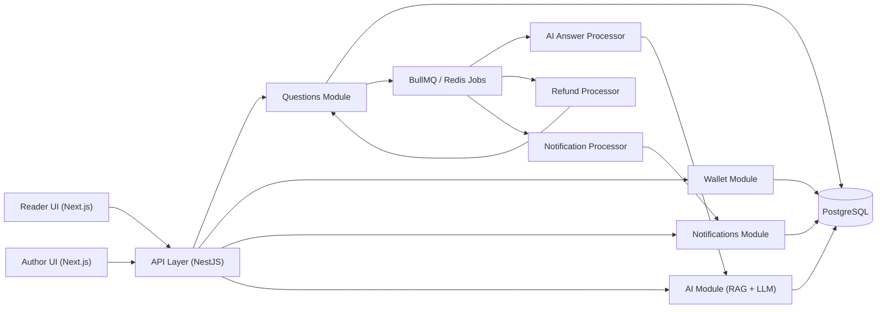
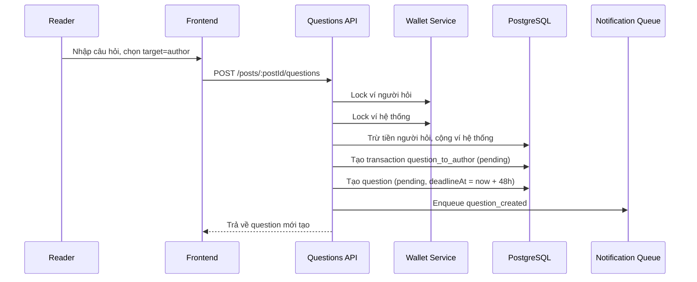
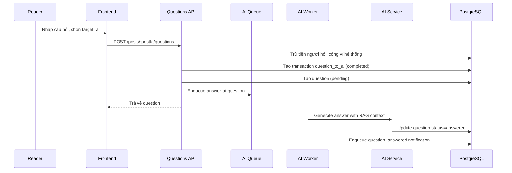
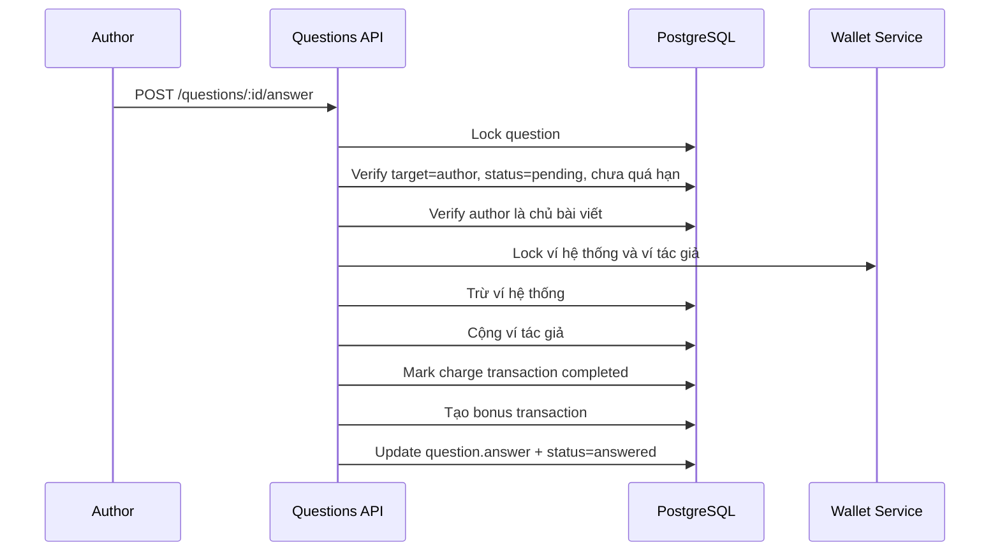
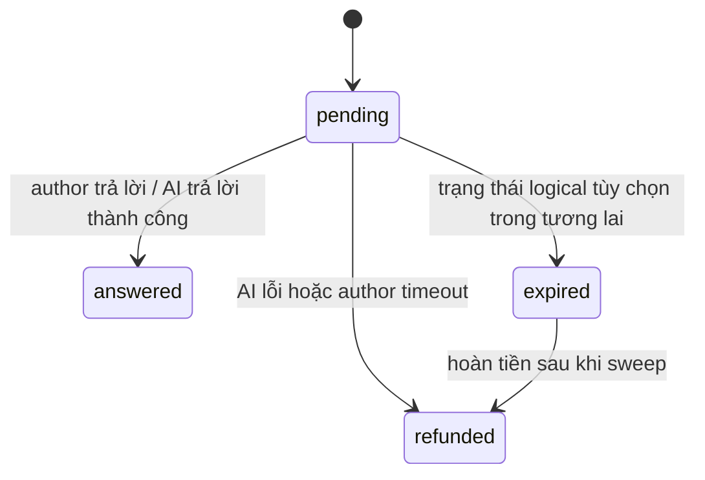

# System Design: Paid Questions to Authors or AI

## 1. Mục tiêu

Thiết kế tính năng cho phép độc giả trả phí để đặt câu hỏi trong ngữ cảnh một bài viết, với hai đích xử lý:

- `author`: câu hỏi được gửi tới tác giả bài viết.
- `ai`: câu hỏi được AI trả lời dựa trên nội dung bài viết và tri thức bổ sung của tác giả.

Tài liệu này bám theo implementation hiện tại trong repo và bổ sung các quyết định thiết kế để feature có thể mở rộng, vận hành ổn định và dễ audit về thanh toán.

## 2. Mục tiêu sản phẩm

- Tạo một kênh monetization trực tiếp cho tác giả.
- Tăng thời gian tương tác trên từng bài viết.
- Cung cấp trải nghiệm "premium Q&A" với SLA rõ ràng.
- Tận dụng AI để trả lời tức thời khi tác giả không cần tham gia trực tiếp.
- Bảo toàn tính đúng đắn tài chính: trừ tiền, giữ tiền, trả tiền, hoàn tiền.

## 3. Phạm vi

### Trong phạm vi

- Đặt câu hỏi trả phí theo từng bài viết.
- Chọn mục tiêu trả lời là tác giả hoặc AI.
- Trừ tiền từ ví nội bộ của người hỏi.
- Escrow cho câu hỏi gửi tác giả.
- Trả thưởng cho tác giả khi họ trả lời.
- Tự động hoàn tiền nếu tác giả không trả lời trong thời hạn.
- Hàng đợi nền cho AI answer, refund sweep và notification.
- Hiển thị trạng thái câu hỏi trong UI.

### Ngoài phạm vi hiện tại

- Dynamic pricing theo tác giả hoặc độ dài câu hỏi.
- Chia doanh thu theo phần trăm nền tảng/tác giả.
- Manual moderation queue cho nội dung câu hỏi.
- Dispute handling sau khi tác giả đã trả lời.
- SLA khác nhau theo từng gói thành viên.

## 4. User stories chính

1. Là độc giả, tôi muốn trả phí để hỏi tác giả về một bài viết cụ thể.
2. Là độc giả, tôi muốn trả phí để AI giải thích bài viết ngay lập tức.
3. Là độc giả, tôi muốn được hoàn tiền nếu tác giả không phản hồi đúng hạn.
4. Là tác giả, tôi muốn thấy danh sách câu hỏi đang chờ xử lý và nhận tiền khi trả lời.
5. Là hệ thống, tôi muốn các thao tác tiền tệ có thể audit được qua transaction log.

## 5. Kiến trúc tổng quan

## 6. Thành phần chính

| Thành phần | Vai trò |
| --- | --- |
| `frontend/src/components/questions/*` | Form đặt câu hỏi, xác nhận thanh toán, hiển thị trạng thái và câu trả lời |
| `backend/src/modules/questions/*` | Business logic tạo câu hỏi, trả lời, hoàn tiền, liệt kê câu hỏi |
| `backend/src/modules/wallet/*` | Ví người dùng, ví hệ thống, transaction log |
| `backend/src/modules/ai/*` | RAG retrieval, gọi LLM, ghi câu trả lời AI |
| `backend/src/jobs/ai-answer.processor.ts` | Worker xử lý câu hỏi AI bất đồng bộ |
| `backend/src/jobs/refund.processor.ts` | Worker sweep câu hỏi tác giả quá hạn |
| `backend/src/modules/notifications/*` | Đẩy thông báo khi có câu hỏi mới, trả lời hoặc hoàn tiền |

## 7. Domain model cốt lõi

### 7.1 `QuestionEntity`

Đại diện cho một yêu cầu hỏi đáp trả phí.

Các field quan trọng:

- `postId`: bài viết mà câu hỏi gắn vào.
- `askerId`: người đặt câu hỏi.
- `target`: `author` hoặc `ai`.
- `content`: nội dung câu hỏi.
- `answer`: câu trả lời cuối cùng.
- `fee`: số tiền bị trừ khỏi ví.
- `transactionId`: liên kết tới giao dịch trừ tiền ban đầu.
- `status`: `pending`, `answered`, `refunded`, `expired`.
- `deadlineAt`: deadline cho câu hỏi gửi tác giả.
- `answeredAt`, `answeredBy`: metadata khi hoàn tất trả lời.

### 7.2 `WalletEntity`

Ví nội bộ của mỗi user và cả ví hệ thống.

Các field vận hành:

- `balance`
- `totalEarned`
- `totalSpent`

### 7.3 `TransactionEntity`

Sổ cái audit cho mọi dòng tiền liên quan đến feature.

Các loại giao dịch đang dùng:

- `question_to_author`
- `question_to_ai`
- `refund`
- `bonus`

Ý nghĩa:

- `question_to_author`: trừ tiền người hỏi và giữ ở ví hệ thống dưới trạng thái `pending`.
- `question_to_ai`: trừ tiền người hỏi và ghi nhận doanh thu nền tảng ngay dưới trạng thái `completed`.
- `bonus`: chuyển tiền từ ví hệ thống sang tác giả khi tác giả trả lời.
- `refund`: hoàn tiền từ ví hệ thống về người hỏi.

### 7.4 `PostEmbeddingEntity` và `DocumentEmbeddingEntity`

Phục vụ RAG cho AI:

- embedding của bài viết.
- embedding của tài liệu bổ sung do tác giả tải lên.

## 8. Quyết định thiết kế cốt lõi

### 8.1 Dùng ví nội bộ thay vì charge trực tiếp mỗi lần hỏi

Lý do:

- giảm độ trễ UX.
- tránh phụ thuộc payment gateway cho mỗi câu hỏi.
- đơn giản hóa logic refund và payout.
- cho phép gom nhiều cơ chế monetization về chung một wallet ledger.

### 8.2 Dùng ví hệ thống làm escrow tập trung

Khi user hỏi tác giả:

- tiền bị trừ khỏi ví người hỏi.
- tiền vào ví hệ thống.
- transaction gốc ở trạng thái `pending`.
- chỉ khi tác giả trả lời mới chuyển tiền sang ví tác giả.

Thiết kế này làm cho refund dễ thực hiện và dễ kiểm toán hơn so với việc chuyển thẳng sang ví tác giả rồi clawback ngược.

### 8.3 Xử lý AI bất đồng bộ qua job queue

Lý do:

- tránh request API bị chặn bởi latency của model.
- dễ retry hoặc refund nếu lỗi.
- có thể scale worker độc lập với web API.

### 8.4 Refund author question theo mô hình sweep

Worker định kỳ quét câu hỏi quá hạn thay vì gắn timer riêng cho từng câu hỏi.

Ưu điểm:

- ít state vận hành hơn.
- không phụ thuộc job delay hàng loạt.
- dễ xử lý restart hoặc recovery.

## 9. Luồng dữ liệu chính

### 9.1 Tạo câu hỏi gửi tác giả

### 9.2 Tạo câu hỏi gửi AI

Nếu enqueue hoặc AI generation thất bại:

- worker gọi refund logic.
- transaction gốc chuyển `refunded`.
- tạo transaction `refund`.
- question chuyển `refunded`.

### 9.3 Tác giả trả lời câu hỏi

### 9.4 Refund do quá hạn

Refund processor chạy mỗi 5 phút:

1. Tìm câu hỏi `target=author`, `status=pending`, `deadlineAt < now`.
2. Khóa record bằng `FOR UPDATE SKIP LOCKED`.
3. Trừ tiền khỏi ví hệ thống.
4. Cộng tiền lại cho người hỏi.
5. Đánh dấu transaction gốc là `refunded`.
6. Tạo transaction `refund`.
7. Đánh dấu question là `refunded`.

## 10. State machine

Ghi chú:

- Trong code hiện tại, `expired` đã có trong enum nhưng refund flow thực tế chuyển thẳng sang `refunded`.
- Nếu cần analytics tách riêng "quá hạn" và "đã hoàn tiền", nên dùng thêm transition `pending -> expired -> refunded`.

## 11. API contract đề xuất

### Reader APIs

- `POST /posts/:postId/questions`
  - body: `content`, `target`, `fee?`
  - auth: bắt buộc
  - rate limit: hiện tại `10 requests / 60s`

- `GET /posts/:postId/questions`
  - public
  - trả về danh sách câu hỏi theo bài viết

- `GET /questions/my-questions`
  - auth
  - trả về lịch sử câu hỏi của user

### Author APIs

- `GET /questions/pending`
  - auth
  - liệt kê câu hỏi `target=author` đang chờ tác giả trả lời

- `POST /questions/:id/answer`
  - body: `answer`
  - auth
  - chỉ tác giả bài viết mới được gọi

## 12. Tính đúng đắn dữ liệu và giao dịch

Đây là phần quan trọng nhất của feature.

### 12.1 Cấp DB transaction

Các thao tác tài chính quan trọng đều nên nằm trong transaction `SERIALIZABLE`:

- tạo câu hỏi và trừ tiền.
- trả lời của tác giả và payout.
- refund.

### 12.2 Pessimistic locking

Các record cần lock:

- wallet người hỏi.
- ví hệ thống.
- ví tác giả.
- question.
- charge transaction.

Mục tiêu:

- tránh double spend.
- tránh double refund.
- tránh double answer payout.

### 12.3 Idempotency

Các điểm cần đảm bảo idempotent:

- AI worker retry.
- refund sweep retry.
- author submit answer nhiều lần.

Implementation hiện tại đã giảm phần lớn rủi ro bằng cách:

- kiểm tra `question.status !== pending` thì dừng.
- kiểm tra `chargeTransaction.status === refunded` thì dừng.
- dùng row lock khi settle hoặc refund.

Đề xuất thêm:

- thêm `idempotency_key` cho request tạo câu hỏi.
- thêm unique constraint hoặc guard logic cho payout transaction theo `referenceId`.

## 13. RAG cho AI answer

AI answer không nên chỉ dựa vào prompt trần. Nên bám theo pipeline:

1. Embed câu hỏi.
2. Retrieval các chunk liên quan từ:
   - bài viết.
   - tài liệu bổ sung của tác giả.
3. Tạo prompt với context đã truy xuất.
4. Gọi model.
5. Lưu answer vào `QuestionEntity`.

Lợi ích:

- tăng độ chính xác theo ngữ cảnh bài viết.
- giảm hallucination.
- biến dữ liệu của tác giả thành lợi thế cạnh tranh.

## 14. Bảo mật và chống abuse

### AuthZ

- Chỉ user đăng nhập mới được đặt câu hỏi.
- Tác giả không được tự hỏi bài của chính mình dưới target `author`.
- Chỉ tác giả của bài viết mới được trả lời.

### Input validation

- `content` tối thiểu 10 ký tự, tối đa 2000.
- `answer` tối thiểu 2 ký tự, tối đa 10000.
- sanitize text trước khi ghi DB.

### Abuse controls nên có thêm

- spam protection theo user/post.
- velocity limit theo số tiền tiêu trong 1 giờ.
- prompt injection guard cho AI context.
- toxicity/moderation trước khi gửi notification hoặc prompt sang model.

## 15. Observability và vận hành

Nên theo dõi các metric sau:

- số câu hỏi theo `target`.
- conversion rate từ mở form đến submit thành công.
- thời gian trả lời trung bình của AI.
- thời gian trả lời trung bình của tác giả.
- refund rate theo tác giả.
- error rate theo worker/job.
- wallet imbalance hoặc transaction mismatch.

Log audit nên có:

- `questionId`
- `postId`
- `askerId`
- `authorId`
- `transactionId`
- `target`
- `status before/after`
- `refundReason`

## 16. Khả năng mở rộng

### Scale đọc/ghi

- `GET /posts/:postId/questions` có thể cache ngắn hạn.
- index DB nên có:
  - `questions(post_id, created_at desc)`
  - `questions(status, target, deadline_at)`
  - `transactions(reference_type, reference_id)`
  - `wallets(user_id)`

### Scale background jobs

- scale riêng AI worker và refund worker.
- đặt concurrency thấp cho payout/refund để giảm contention.
- AI worker cần queue độc lập với payment/refund để lỗi model không ảnh hưởng settlement.

### Scale AI

- hỗ trợ fallback model/provider.
- thêm circuit breaker khi model provider lỗi.
- thêm timeout cứng cho mỗi job AI.

## 17. Rủi ro và cách giảm thiểu

| Rủi ro | Ảnh hưởng | Giảm thiểu |
| --- | --- | --- |
| AI provider lỗi | user đã bị trừ tiền nhưng không có câu trả lời | refund tự động |
| Author không phản hồi | trải nghiệm xấu, mất niềm tin | deadline + sweep refund |
| Double payout | thất thoát tiền | lock question + lock transaction + guard theo status |
| Double refund | sai lệch sổ cái | lock + check transaction status |
| Ví hệ thống thiếu tiền | refund/payout fail | wallet reconciliation và alerting |
| Nội dung độc hại | ảnh hưởng AI/notification/UI | sanitize + moderation |

## 18. Các cải tiến nên làm tiếp

1. Tách rõ `escrow_balance` khỏi `platform_revenue` thay vì dùng chung một ví hệ thống.
2. Bổ sung bảng ledger entries chuẩn double-entry thay vì chỉ dùng transaction summary.
3. Cho phép tác giả cấu hình giá hỏi riêng theo bài viết hoặc profile.
4. Thêm SLA badge và auto-reminder trước khi hết hạn.
5. Tạo dashboard cho tác giả: pending questions, earnings, refund ratio.
6. Thêm search/filter cho câu hỏi theo trạng thái và mục tiêu.
7. Dùng status `expired` thực sự để analytics rõ hơn.
8. Thêm idempotency key cho create question API.

## 19. Mapping với codebase hiện tại

Các file chính liên quan:

- `backend/src/modules/questions/questions.service.ts`
- `backend/src/modules/questions/entities/question.entity.ts`
- `backend/src/modules/questions/questions.controller.ts`
- `backend/src/modules/wallet/wallet.service.ts`
- `backend/src/modules/ai/ai.service.ts`
- `backend/src/jobs/ai-answer.processor.ts`
- `backend/src/jobs/refund.processor.ts`
- `frontend/src/components/questions/QuestionForm.tsx`
- `frontend/src/components/questions/QuestionSection.tsx`
- `frontend/src/services/api/questions.api.ts`

## 20. Kết luận

Feature "paid questions to authors or AI" phù hợp với kiến trúc hiện tại của hệ thống vì đã có sẵn:

- ví nội bộ để xử lý tiền nhanh.
- transaction log để audit.
- queue để chạy AI và refund bất đồng bộ.
- RAG pipeline để AI trả lời theo ngữ cảnh bài viết.

Thiết kế hợp lý nhất ở giai đoạn này là:

- dùng wallet nội bộ làm lớp thanh toán trung gian,
- dùng ví hệ thống làm escrow cho câu hỏi gửi tác giả,
- ghi đầy đủ transaction cho mọi thay đổi tiền tệ,
- xử lý AI và refund qua job queue,
- sau đó mới tối ưu tiếp về pricing, ledger chuẩn kế toán và analytics.
