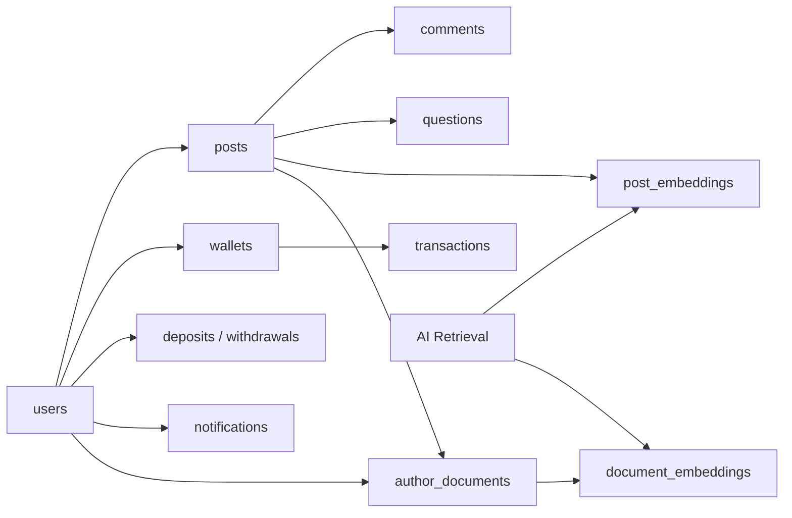

# System Design: PostgreSQL + TypeORM Data Model with pgvector for AI Context Lookup

## 1. Mục tiêu

Thiết kế một data model trên `PostgreSQL` với `TypeORM` làm ORM chính, đồng thời mở rộng bằng `pgvector` để:

- lưu trữ dữ liệu nghiệp vụ cốt lõi của nền tảng blog,
- hỗ trợ schema evolution ổn định qua migration,
- quản lý được cả dữ liệu quan hệ lẫn dữ liệu bán cấu trúc,
- lưu embedding vector cho bài viết và tài liệu của tác giả,
- truy xuất context liên quan phục vụ AI question answering theo mô hình RAG.

Tài liệu này bám theo implementation hiện tại trong repo và tập trung vào cách hệ thống kết hợp:

- `PostgreSQL` cho transactional consistency,
- `TypeORM` cho entity model, repository và migration lifecycle,
- `pgvector` cho vector similarity search,
- raw SQL chọn lọc ở những chỗ TypeORM không đủ tiện cho vector operations.

## 2. Bài toán hệ thống cần giải quyết

Ứng dụng không chỉ là một CRUD blog đơn giản. Data model cần phục vụ đồng thời:

- người dùng, phân quyền và hồ sơ,
- bài viết, tag, category, comment, question,
- ví, giao dịch, nạp/rút tiền,
- notification,
- lớp AI retrieval từ nội dung bài viết và tài liệu tác giả.

Điều này đòi hỏi một schema vừa:

- đủ chặt để giữ integrity cho money flow và content flow,
- vừa đủ linh hoạt để lưu rich content JSONB, metadata JSONB và vector embeddings.

## 3. Quyết định công nghệ

### 3.1 Vì sao chọn PostgreSQL

PostgreSQL phù hợp vì hệ thống có nhiều yêu cầu đồng thời:

- transaction mạnh,
- foreign key và constraint rõ ràng,
- JSONB cho rich/semi-structured data,
- extension `pgvector` để mở rộng sang vector retrieval,
- khả năng indexing tốt cho cả dữ liệu chuẩn và dữ liệu AI.

### 3.2 Vì sao chọn TypeORM

`TypeORM` đang được dùng để:

- định nghĩa entity bằng code,
- inject repository theo module,
- tạo migration và quản lý vòng đời schema,
- dùng transaction và row locking ở service layer.

### 3.3 Vì sao vẫn cần raw SQL

Repo hiện không cố ép toàn bộ logic vector qua TypeORM abstraction.

Những tác vụ dùng raw SQL:

- insert vào cột `vector` qua cú pháp `$n::vector`,
- truy vấn similarity bằng toán tử `<=>`,
- union nhiều nguồn context trong cùng một truy vấn.

Đây là lựa chọn đúng về mặt thực dụng, vì TypeORM entity model rất hợp cho schema và CRUD, nhưng kém tự nhiên hơn cho truy vấn vector chuyên biệt.

## 4. Kiến trúc dữ liệu tổng quan



## 5. Cấu hình cơ sở dữ liệu trong repo

### 5.1 `database.config.ts`

Repo dùng:

- `type = postgres`
- `synchronize = false`
- `autoLoadEntities = true`
- cấu hình SSL theo env

Ý nghĩa:

- schema không bị tự ý mutate ở runtime,
- mọi thay đổi phải đi qua migration,
- module nào đăng ký entity thì TypeORM tự load entity đó vào app.

### 5.2 `typeorm.config.ts`

File này tạo `DataSource` riêng cho CLI/migrations và chọn path migration theo:

- source `.ts` khi chạy dev,
- compiled `.js` khi chạy dist.

Thiết kế này giúp:

- migration chạy ổn định trong cả dev và production build,
- tách rõ app runtime config và CLI data source config.

## 6. Nguyên tắc thiết kế data model

Repo hiện theo các nguyên tắc khá rõ:

1. Dùng `UUID` làm primary key cho gần như mọi bảng.
2. Dùng `timestamptz` cho tất cả timestamp quan trọng.
3. Dùng foreign key ở các quan hệ quan trọng.
4. Dùng `CHECK` constraint cho enum-like status ở DB layer.
5. Dùng `JSONB` ở nơi cần payload linh hoạt.
6. Dùng trigger `updated_at` ở các bảng thay đổi thường xuyên.
7. Dùng index theo truy vấn thực tế thay vì chỉ index mặc định.

## 7. Schema nền tảng nghiệp vụ

Migration `InitPhaseOneSchema` tạo các nhóm bảng chính sau.

### 7.1 Identity và profile

- `users`

Field nổi bật:

- `email`
- `password_hash`
- `display_name`
- `avatar_url`
- `bio`
- `role`
- `is_verified`

Lý do:

- giữ một bảng user trung tâm cho auth, authoring và payment ownership.

### 7.2 Nội dung

- `posts`
- `categories`
- `tags`
- `post_tags`
- `comments`
- `reactions`

Điểm đáng chú ý ở `posts`:

- `content` dùng `JSONB`
- `content_plain` dùng `TEXT`

Thiết kế này cho phép:

- lưu rich editor structure trong `content`,
- vẫn có plain text để search, chunking và embedding.

### 7.3 Monetization và transactional domain

- `wallets`
- `transactions`
- `questions`
- `deposits`
- `withdrawals`

Nhóm này được thiết kế với:

- status chặt chẽ,
- balance dạng `BIGINT`,
- reference từ transaction sang entity nghiệp vụ qua `reference_type`, `reference_id`.

### 7.4 AI knowledge layer

- `author_documents`
- `post_embeddings`
- `document_embeddings`

Đây là phần mở rộng quan trọng biến relational database thành nơi lưu cả retrieval index cho AI context lookup.

## 8. Vì sao `JSONB` được dùng ở một số bảng

Repo dùng `JSONB` ở các điểm như:

- `posts.content`
- `transactions.metadata`
- `notifications.data`
- `deposits.webhook_data`
- `post_embeddings.metadata`

Lợi ích:

- schema linh hoạt hơn cho payload thay đổi theo feature,
- vẫn query/index được nếu cần,
- tránh nổ thêm nhiều bảng nhỏ cho dữ liệu phụ trợ.

Tradeoff:

- cần giữ discipline ở application layer để payload không bị trôi schema quá mức,
- không nên lạm dụng JSONB cho dữ liệu core có quan hệ rõ ràng.

## 9. Migration strategy

### 9.1 Initial schema

Migration đầu tiên:

- tạo extension `pgcrypto`
- tạo extension `vector`
- tạo type/constraint
- tạo bảng
- tạo index
- tạo trigger `set_row_updated_at()`

### 9.2 Evolutionary migrations

Schema sau đó được mở rộng qua migration riêng như:

- `AddManualMomoQrDeposits`
- `AddVcbQrDepositFields`
- `AddOcbQrPaymentMethod`
- các migration khác cho auth, notifications, social login

Điều này cho thấy team đang đi theo hướng đúng:

- evolve schema incremental,
- tránh sửa tay schema production,
- giữ khả năng replay toàn bộ lịch sử DB.

## 10. Trigger và audit timestamp

Migration tạo function:

```sql
set_row_updated_at()
```

và gắn trigger cho:

- `users`
- `wallets`
- `posts`
- `comments`
- `transactions`
- `questions`

Lợi ích:

- tránh quên cập nhật `updated_at` ở tầng app,
- đồng bộ timestamp behavior ở DB layer.

## 11. Chỉ mục phục vụ truy vấn nghiệp vụ

Repo đã tạo nhiều index theo access pattern thực tế:

### 11.1 Content domain

- `idx_posts_author`
- `idx_posts_category`
- `idx_posts_status`
- `idx_posts_published`
- `idx_comments_post`
- `idx_comments_parent`

### 11.2 Transactional domain

- `idx_transactions_sender`
- `idx_transactions_receiver`
- `idx_transactions_status`
- `idx_transactions_created`
- `idx_transactions_reference`

### 11.3 Question domain

- `idx_questions_post`
- `idx_questions_asker`
- `idx_questions_status`
- `idx_questions_deadline WHERE status = 'pending'`

### 11.4 Deposit/withdrawal domain

- `idx_deposits_user`
- `idx_deposits_status`
- `idx_deposits_code`
- `idx_deposits_expires`
- `idx_deposits_manual_method_status`
- `idx_withdrawals_user`
- `idx_withdrawals_status`

Các index này cho thấy data model được thiết kế bám theo flow sản phẩm chứ không chỉ theo lý thuyết entity relationship.

## 12. Mô hình dữ liệu AI / RAG

### 12.1 `author_documents`

Bảng này lưu knowledge bổ sung do tác giả cung cấp.

Field chính:

- `author_id`
- `post_id` nullable
- `file_url`
- `file_name`
- `content_plain`
- `is_processed`

Ý nghĩa:

- tài liệu có thể gắn riêng vào một bài viết hoặc ở mức tác giả,
- raw content được lưu lại để re-index khi cần,
- `is_processed` cho biết tài liệu đã được embedding hay chưa.

### 12.2 `post_embeddings`

Mỗi bài viết sau khi index sẽ được tách chunk và lưu vào bảng này.

Field chính:

- `post_id`
- `chunk_index`
- `chunk_text`
- `embedding vector(768)`
- `metadata JSONB`

`metadata` hiện chứa thông tin như:

- `title`
- `authorId`
- `chunkIndex`
- `source`

### 12.3 `document_embeddings`

Mỗi tài liệu của tác giả cũng được chunk và embedding tương tự.

Field chính:

- `document_id`
- `author_id`
- `chunk_index`
- `chunk_text`
- `embedding vector(768)`

### 12.4 Vì sao tách riêng `post_embeddings` và `document_embeddings`

Thiết kế này có lợi vì:

- post content và author document có lifecycle khác nhau,
- điều kiện filter cũng khác nhau,
- query vẫn có thể `UNION ALL` hai nguồn khi retrieval,
- dễ reindex từng nguồn độc lập.

## 13. Entity mapping trong TypeORM

### 13.1 Vector column mapping

`PostEmbeddingEntity` và `DocumentEmbeddingEntity` map cột vector như sau:

- `type: 'vector'`
- `length: 768`

Đây là điểm quan trọng: entity layer biết rõ rằng embedding nằm trong cột vector của PostgreSQL, không phải chỉ là `text` hay `json`.

### 13.2 Representation trong code

Ở entity:

- `embedding` được map kiểu `string`

Nhưng ở embedding/retrieval service:

- hệ thống thao tác với `number[]`
- rồi convert sang `vectorLiteral` như `"[0.12,0.34,...]"`

Lý do:

- phù hợp với cách insert raw SQL `::vector`,
- tránh phải phụ thuộc hoàn toàn vào serialization behavior của ORM cho custom vector type.

## 14. Embedding pipeline

### 14.1 Chunking

`ChunkingService` cắt text thành chunk theo độ dài ký tự, hiện thường dùng:

- `chunkSize = 700` khi index cho AI retrieval

Mục tiêu:

- giữ mỗi chunk đủ nhỏ cho retrieval chính xác,
- nhưng đủ lớn để không mất ngữ cảnh quá nhiều.

### 14.2 Embedding generation

`EmbeddingService` hiện dùng một embedding strategy nội bộ deterministic:

- normalize text,
- tách token,
- tạo unigram + bigram feature,
- hash vào vector 768 chiều,
- chuẩn hóa vector về unit length.

Điều này cho thấy data model đã sẵn sàng cho vector retrieval, kể cả khi provider embedding thực tế có thể được thay sau này.

### 14.3 Lưu vector vào DB

Khi index bài viết hoặc document:

1. service xóa embedding cũ của object đó,
2. tạo chunk,
3. sinh embedding cho từng chunk,
4. insert từng hàng bằng raw SQL:
   - `... VALUES (..., $4::vector, ...)`

Thiết kế này đảm bảo:

- reindex là idempotent ở mức object,
- vector luôn đồng bộ với version text hiện tại.

## 15. Vì sao repo dùng raw SQL cho insert vector

Trong `AiService.indexPost()` và `AiService.indexAuthorDocument()`:

- dùng `manager.query(...)`
- cast trực tiếp `::vector`

Lý do kỹ thuật hợp lý:

- insert `vector` bằng raw SQL rõ ràng hơn,
- dễ kiểm soát format literal,
- ít bất ngờ hơn so với custom transformer/driver behavior của ORM.

Đây là một mô hình hybrid rất thực dụng:

- entity/repository cho phần lớn CRUD,
- raw SQL cho vector-heavy operations.

## 16. Retrieval model

### 16.1 Input

`RetrievalService.searchRelevantContext()` nhận:

- `question`
- `postId?`
- `authorId?`
- `topK?`
- `vector?`

### 16.2 Primary retrieval bằng vector search

Service:

1. embed câu hỏi nếu chưa có vector,
2. convert thành `vectorLiteral`,
3. chạy truy vấn SQL hợp nhất cả:
   - `post_embeddings`
   - `document_embeddings`

Truy vấn tính:

```sql
1 - (embedding <=> $1::vector) AS similarity
```

và `ORDER BY similarity DESC`.

### 16.3 Vì sao dùng toán tử `<=>`

Repo tạo index:

- `USING hnsw (embedding vector_cosine_ops)`

Điều đó cho thấy similarity metric được thiết kế theo cosine distance.

`1 - distance` được dùng để chuyển sang một score dễ đọc hơn cho application layer.

### 16.4 Cross-source retrieval

Truy vấn `UNION ALL` kết quả từ:

- chunk của bài viết hiện tại,
- chunk của document do tác giả cung cấp,

với filter:

- `post_id = current post` cho bài viết,
- `author_id = current author`
- document có thể gắn với post hiện tại hoặc ở mức author-wide.

Đây là một thiết kế RAG khá hợp lý cho blog/creator platform.

## 17. Fallback retrieval

Nếu vector retrieval chưa đủ `topK`, service fallback sang text heuristic:

- tokenize câu hỏi,
- tính overlap giữa question terms và chunk terms,
- ưu tiên chunk match term,
- nếu không có, với post có thể lấy vài leading chunks làm fallback.

Ý nghĩa:

- hệ thống không phụ thuộc hoàn toàn vào vector search,
- tăng resilience khi embedding chưa tốt hoặc dữ liệu còn ít.

## 18. Vì sao `pgvector` phù hợp ở đây

`pgvector` phù hợp vì bài toán retrieval hiện tại:

- số bảng vector còn tương đối kiểm soát được,
- context lookup gắn chặt với dữ liệu quan hệ hiện có,
- cần join/filter theo `post_id`, `author_id`, `document_id`,
- muốn giữ ingestion và retrieval trong một hệ quản trị dữ liệu duy nhất.

Ưu điểm:

- không cần thêm một vector database riêng,
- transaction giữa content record và embedding record đơn giản hơn,
- vận hành gọn hơn trong giai đoạn đầu.

## 19. HNSW index strategy

Repo tạo:

- `idx_embeddings_vector USING hnsw (embedding vector_cosine_ops)`
- `idx_doc_embeddings_vector USING hnsw (embedding vector_cosine_ops)`

Đây là quyết định hợp lý khi:

- vector search cần nhanh hơn full scan,
- dữ liệu embedding có thể tăng theo số lượng post/document,
- cosine similarity là metric phù hợp với normalized embeddings.

Tradeoff:

- HNSW có chi phí build/indexing và dùng thêm bộ nhớ,
- nhưng hợp lý cho read-heavy retrieval.

## 20. TypeORM + PostgreSQL layering strategy

Có thể xem repo đang theo mô hình 3 lớp dữ liệu:

### 20.1 Entity layer

Định nghĩa schema logic bằng class:

- `PostEntity`
- `QuestionEntity`
- `WalletEntity`
- `AuthorDocumentEntity`
- `PostEmbeddingEntity`
- `DocumentEmbeddingEntity`

### 20.2 Repository / transaction layer

Service layer dùng:

- repository CRUD cho flow thường,
- `DataSource.transaction(...)` cho flow quan trọng,
- pessimistic locking cho payment/question flow.

### 20.3 SQL-specialized layer

Raw SQL được dùng ở nơi database feature quan trọng hơn abstraction:

- vector insert,
- vector similarity search,
- union retrieval query.

Đây là một kiến trúc cân bằng tốt giữa tốc độ phát triển và khả năng tối ưu.

## 21. Current implementation notes

Đây là các điểm đúng với code hiện tại:

1. Database runtime dùng `synchronize: false`.
2. Entity được nạp qua `autoLoadEntities: true`.
3. Migration đầu tiên tạo extension `vector`.
4. Cột embedding hiện là `vector(768)`.
5. `pgvector` hiện được dùng cho:
   - `post_embeddings.embedding`
   - `document_embeddings.embedding`
6. Insert vector và search vector dùng raw SQL qua `DataSource.query()` / `manager.query()`.
7. Retrieval search vector trên cả post chunks lẫn author document chunks trong cùng một truy vấn.
8. Repo có fallback keyword retrieval nếu vector results chưa đủ.
9. Embedding provider hiện tại là deterministic-local, nhưng schema đã sẵn cho embedding provider thật.

## 22. Rủi ro và hạn chế hiện tại

### 22.1 Summary table + vector table cùng trong một DB

Đây là lợi thế ở giai đoạn đầu, nhưng khi scale lớn:

- write amplification do reindex,
- maintenance cost của HNSW index,
- contention resource giữa OLTP và retrieval query có thể tăng.

### 22.2 Embedding dimension hiện hard-coded theo config/entity

Nếu đổi model embedding với dimension khác:

- cần migration hoặc bảng mới,
- không thể đơn giản đổi env rồi dùng lại data cũ.

### 22.3 `amount` overwrite ở deposit không liên quan trực tiếp tới AI

Đây không phải vấn đề của vector model, nhưng nhắc để thấy data model toàn hệ thống vẫn có vài chỗ cần refinement thêm.

## 23. Hướng cải tiến tiếp theo

1. Tách rõ `requested_amount` và `credited_amount` ở các bảng payment nếu muốn schema chuẩn hơn.
2. Thêm versioning cho embedding model để reindex kiểm soát tốt hơn.
3. Xem xét `ivfflat` hoặc tuning HNSW params nếu dữ liệu tăng mạnh.
4. Thêm index/filter strategy sâu hơn cho multi-tenant author/document retrieval.
5. Thêm ingestion status chi tiết hơn cho `author_documents`.
6. Bổ sung metadata schema rõ ràng hơn cho `post_embeddings.metadata`.
7. Nếu quy mô retrieval tăng lớn, cân nhắc tách vector workload sang service/db chuyên dụng, nhưng chỉ khi pgvector trong PostgreSQL không còn đáp ứng được.

## 24. Mapping với codebase hiện tại

Các file quan trọng:

- `backend/src/config/database.config.ts`
- `backend/src/database/typeorm.config.ts`
- `backend/src/database/migrations/20260321120000-InitPhaseOneSchema.ts`
- `backend/src/database/migrations/20260322173000-AddManualMomoQrDeposits.ts`
- `backend/src/database/migrations/20260323110000-AddVcbQrDepositFields.ts`
- `backend/src/database/migrations/20260323203000-AddOcbQrPaymentMethod.ts`
- `backend/src/modules/posts/entities/post.entity.ts`
- `backend/src/modules/ai/entities/author-document.entity.ts`
- `backend/src/modules/ai/entities/post-embedding.entity.ts`
- `backend/src/modules/ai/entities/document-embedding.entity.ts`
- `backend/src/modules/ai/ai.service.ts`
- `backend/src/modules/ai/rag/chunking.service.ts`
- `backend/src/modules/ai/rag/embedding.service.ts`
- `backend/src/modules/ai/rag/retrieval.service.ts`

## 25. Kết luận

Data model hiện tại của repo là một thiết kế thực dụng và đúng hướng:

- dùng `PostgreSQL` làm nguồn sự thật duy nhất cho cả transactional data lẫn AI retrieval data,
- dùng `TypeORM` cho entity model, migration và phần lớn CRUD/transaction flow,
- dùng `pgvector` để lưu embedding ngay trong database quan hệ,
- và chấp nhận dùng raw SQL đúng chỗ để truy vấn vector hiệu quả hơn.

Điểm mạnh nhất của thiết kế này là nó không tách AI retrieval thành một hệ thống hoàn toàn riêng biệt quá sớm. Thay vào đó, nó tận dụng relational model sẵn có, giữ context gần với dữ liệu nghiệp vụ, và chỉ mở rộng đúng phần cần bằng `pgvector`. Với quy mô hiện tại, đó là một kiến trúc rất hợp lý.
