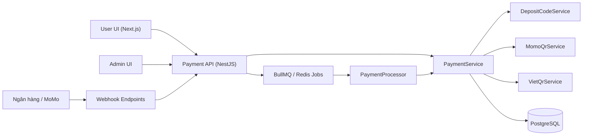
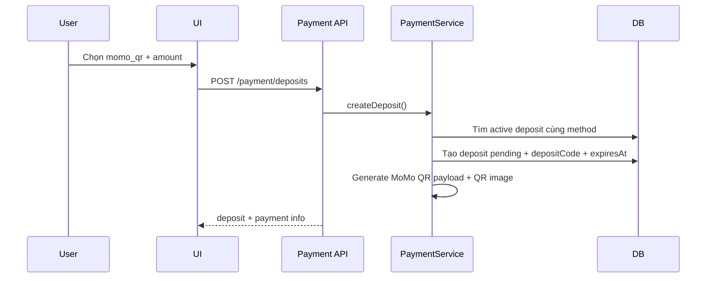
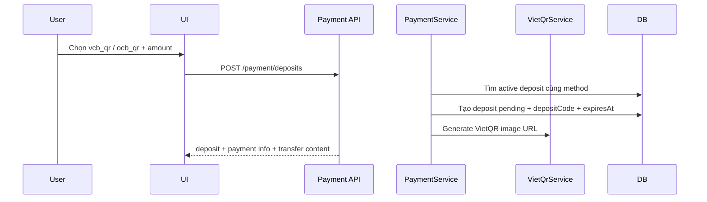
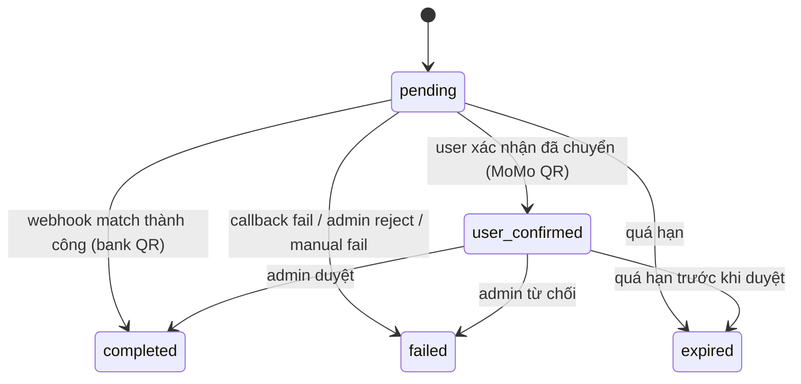

# System Design: Integrated QR-Based Payment Methods with Webhook-Confirmed Deposits

## 1. Mục tiêu

Thiết kế tính năng nạp tiền bằng QR tích hợp cho nền tảng, bao gồm:

- `MoMo QR` cho luồng bán tự động,
- `bank VietQR` như `VCB QR` hoặc `OCB QR` cho luồng tự động hơn,
- webhook-based confirmation để đối soát và cộng ví nhanh sau khi chuyển khoản.

Mục tiêu là cung cấp một lớp deposit thống nhất để người dùng có thể:

- tạo yêu cầu nạp tiền,
- nhận QR phù hợp với từng phương thức,
- chuyển tiền ngoài hệ thống,
- được cộng ví theo quy trình bán tự động hoặc tự động,
- tra cứu trạng thái deposit minh bạch từ UI.

Tài liệu này bám sát implementation hiện tại trong repo và chỉ ra những điểm thiết kế đang có, những ràng buộc vận hành, cùng hướng mở rộng tiếp theo.

## 2. Bài toán nghiệp vụ

Hệ thống cần đồng thời hỗ trợ hai nhóm flow khác nhau:

### 2.1 Semi-automated deposit

Áp dụng cho `MoMo QR`.

Đặc điểm:

- hệ thống sinh QR và theo dõi deposit request,
- user tự chuyển tiền ngoài hệ thống,
- user xác nhận đã chuyển tiền,
- admin duyệt thủ công trước khi cộng ví.

### 2.2 Automated deposit

Áp dụng cho `bank VietQR` như `VCB QR`, `OCB QR`.

Đặc điểm:

- hệ thống sinh QR kèm transfer content duy nhất,
- ngân hàng hoặc đơn vị trung gian gửi webhook,
- backend tự đối soát nội dung và số tiền,
- ví được cộng tự động nếu match thành công.

## 3. Mục tiêu thiết kế

- Hợp nhất nhiều QR payment method dưới cùng một domain `deposit`.
- Tách rõ “tạo yêu cầu nạp” và “xác nhận tiền đã về”.
- Hạn chế cộng ví nhầm hoặc cộng trùng.
- Cho phép dùng chung UI và data model cho cả manual review lẫn auto-credit.
- Hỗ trợ audit và reconciliation qua `deposits` + `transactions`.

## 4. Ngoài phạm vi

- Payout ra ngân hàng.
- KYC/AML nâng cao.
- Refund tự động cho deposit đã matched nhưng chưa settle ra external system.
- Nhiều loại tiền tệ.
- Smart routing giữa nhiều nhà cung cấp QR theo chi phí.

## 5. Tổng quan kiến trúc

## 6. Thành phần chính trong repo

| Thành phần | Vai trò |
| --- | --- |
| `backend/src/modules/payment/payment.controller.ts` | Expose API cho create deposit, confirm transfer, admin review, webhooks |
| `backend/src/modules/payment/payment.service.ts` | Điều phối toàn bộ flow deposit QR |
| `backend/src/modules/payment/services/momo-qr.service.ts` | Sinh payload và QR image cho MoMo QR |
| `backend/src/modules/payment/services/viet-qr.service.ts` | Sinh VietQR image URL cho QR ngân hàng |
| `backend/src/modules/payment/services/deposit-code.service.ts` | Sinh và parse `depositCode` để đối soát |
| `backend/src/jobs/payment.processor.ts` | Worker xử lý callback queue và job hết hạn deposit |
| `backend/src/modules/wallet/entities/deposit.entity.ts` | Bảng nguồn sự thật cho deposit request |
| `backend/src/modules/wallet/entities/wallet.entity.ts` | Ví nội bộ được cộng số dư khi deposit thành công |
| `backend/src/modules/wallet/entities/transaction.entity.ts` | Lịch sử audit khi cộng ví thành công |
| `frontend/src/components/wallet/DepositForm.tsx` | UI chọn method, sinh QR, hiển thị trạng thái và hướng dẫn |

## 7. Domain model

### 7.1 `DepositEntity`

`DepositEntity` là tâm điểm của tính năng.

Field chính:

- `id`: mã định danh deposit.
- `userId`: user sở hữu request nạp tiền.
- `amount`: số tiền dự kiến hoặc số tiền credited cuối cùng.
- `depositCode`: mã đối soát duy nhất như `NAPXXXXXX`.
- `paymentMethod`: `momo_qr`, `vcb_qr`, `ocb_qr`, hoặc method legacy khác.
- `paymentRef`: mã tham chiếu từ provider/webhook nếu có.
- `status`: `pending`, `user_confirmed`, `completed`, `failed`, `expired`.
- `qrData`: payload QR raw, chủ yếu cho MoMo QR.
- `qrImageUrl`: hình QR hiển thị cho UI.
- `transferProofUrl`: ảnh chứng minh user gửi tiền, dùng cho flow manual.
- `expiresAt`: thời điểm hết hạn QR.
- `matchedAt`: thời điểm webhook match thành công.
- `webhookData`: raw data từ webhook để audit.
- `adminConfirmedBy`, `adminNote`: phục vụ manual review.
- `completedAt`: thời điểm cộng ví thành công.

### 7.2 `WalletEntity`

Ví được cộng tiền sau khi deposit hoàn tất:

- `balance`
- `totalEarned`
- `totalSpent`

Trong flow deposit hiện tại, chỉ `balance` được cộng trực tiếp.

### 7.3 `TransactionEntity`

Khi deposit thành công, hệ thống tạo transaction:

- `type = deposit`
- `status = completed`
- `referenceId = deposit.id`
- `referenceType = deposit`

Metadata chứa:

- provider,
- depositCode,
- webhook source,
- bank transaction id,
- review mode,
- callback status,
- credited amount.

## 8. Phân loại phương thức thanh toán

| Method | QR generator | Confirmation mode | Final settlement |
| --- | --- | --- | --- |
| `momo_qr` | `MomoQrService` | user confirm + admin review | semi-automated |
| `vcb_qr` | `VietQrService` | bank webhook match | automated |
| `ocb_qr` | `VietQrService` | bank webhook match | automated |
| `vnpay`, `momo` | provider callback cũ | callback verify | legacy / non-QR primary flow |

## 9. Cấu hình

### 9.1 MoMo QR config

Đọc từ `payment.momoQr`:

- `phone`
- `name`
- `minAmount`
- `maxAmount`
- `expireMinutes`
- `allowedAmounts`

### 9.2 Bank QR config

Mỗi ngân hàng có:

- `bankCode`
- `bankName`
- `accountNumber`
- `accountName`
- `template`
- `minAmount`
- `maxAmount`
- `expireMinutes`
- `allowedAmounts`

### 9.3 Webhook config

- `payment.casso.webhookSecret`
- `payment.sepay.apiKey`

## 10. Luồng tổng quát

Mọi method đi qua cùng một entrypoint:

- `POST /payment/deposits`

Backend quyết định flow dựa trên `paymentMethod`.

### Bước chung

1. Xác thực user.
2. Expire các deposit cũ quá hạn của chính user.
3. Validate amount theo config method.
4. Tìm active deposit cùng method để reuse hoặc refresh.
5. Nếu chưa có active deposit thì tạo deposit mới.
6. Sinh QR hoặc payment instructions tương ứng.
7. Trả về:
   - `deposit`
   - `payment`

## 11. `depositCode` là chìa khóa đối soát

Hệ thống sinh mã kiểu `NAPXXXXXX` qua `DepositCodeService`.

Mục tiêu:

- giúp phân biệt nhiều giao dịch cùng amount,
- đưa một khóa match ổn định vào transfer content,
- cho phép webhook tìm đúng deposit đang chờ,
- giảm phụ thuộc vào amount-only matching.

### Quy tắc parse

`parseDepositCode()`:

- uppercase,
- bỏ khoảng trắng và dấu `-`,
- match regex `NAP([A-Z0-9]{6})`.

Điều này cho phép webhook vẫn match được nếu nội dung chuyển khoản bị user nhập hơi khác định dạng ban đầu.

## 12. Luồng `MoMo QR` bán tự động

### 12.1 Create request

### 12.2 Sau khi user chuyển tiền

User gọi:

- `POST /payment/deposits/:id/confirm`

Backend:

1. kiểm tra deposit thuộc về user,
2. chỉ cho phép `paymentMethod = momo_qr`,
3. sync expire nếu cần,
4. chỉ chấp nhận khi deposit còn ở `pending` hoặc `user_confirmed`,
5. set:
   - `status = user_confirmed`
   - `userConfirmedAt`
   - `transferProofUrl`

### 12.3 Admin review

Admin gọi:

- `PATCH /payment/admin/deposits/:id`

Nếu approve:

1. lock deposit,
2. check method là `momo_qr`,
3. check chưa expired,
4. lock wallet,
5. cộng `wallet.balance`,
6. mark deposit `completed`,
7. lưu `adminConfirmedBy`, `adminNote`, `completedAt`,
8. tạo transaction `deposit`.

Nếu reject:

1. mark deposit `failed`,
2. lưu `adminConfirmedBy`, `adminNote`,
3. không cộng ví.

### 12.4 Vì sao gọi là semi-automated

Vì hệ thống đã tự động hóa:

- tạo request,
- sinh QR,
- quản lý expiry,
- lưu proof,
- quản lý trạng thái,
- ghi audit data.

Nhưng quyết định cộng ví cuối cùng vẫn cần admin xác minh.

## 13. Luồng `VietQR` tự động qua webhook

### 13.1 Create request

UI hướng dẫn user:

- quét QR ngân hàng,
- chuyển đúng số tiền,
- giữ nguyên `depositCode` trong nội dung chuyển khoản.

### 13.2 Webhook ingestion

Webhook đi vào:

- `POST /payment/webhook/casso`
- `POST /payment/webhook/sepay`

Controller verify trước:

- Casso dùng header `secure-token`.
- SePay dùng header `authorization: Apikey ...`.

Sau đó `PaymentService`:

1. normalize payload thành danh sách `NormalizedBankWebhookTransaction`,
2. đọc:
   - `transactionId`
   - `amount`
   - `paymentCode`
   - `description`
   - `occurredAt`
3. trích `depositCode` từ `paymentCode` hoặc parse từ `description`,
4. tìm deposit:
   - cùng `depositCode`,
   - method là bank QR được hỗ trợ,
   - `status = pending`,
5. kiểm tra expire,
6. tính `creditedAmount`,
7. transactionally:
   - lock deposit,
   - lock wallet,
   - cộng ví,
   - mark deposit completed,
   - lưu `matchedAt`, `paymentRef`, `webhookData`,
   - tạo transaction `deposit`.

### 13.3 Vì sao gọi là automated

Sau khi user chuyển tiền đúng:

- không cần user bấm confirm,
- không cần admin duyệt,
- chỉ cần webhook match thành công là ví được cộng.

## 14. Chính sách amount matching

Hệ thống hiện dùng:

`creditedAmount = min(actualAmount, expectedAmount)`

Ý nghĩa:

- nếu user chuyển thiếu, ví được cộng theo số nhận thực tế,
- nếu user chuyển dư, ví chỉ được cộng theo amount của deposit request.

### Hệ quả

Ưu điểm:

- tránh cộng vượt amount đã tạo QR.

Nhược điểm:

- khoản chuyển dư không được tự động cộng hết,
- cần quy trình reconciliation riêng nếu muốn xử lý tiền dư.

### Cách lưu audit

`adminNote` / `webhookData` ghi lại:

- số tiền ngân hàng báo,
- số tiền expected,
- số tiền thực sự credited.

## 15. Expiration strategy

Deposit QR không tồn tại vô hạn.

### Config mặc định

- `momo_qr`: `30 phút`
- `vcb_qr`, `ocb_qr`: `15 phút`

### Hai cách expire

1. Sync expire:
   - khi user tạo deposit mới,
   - khi user hỏi trạng thái,
   - khi admin review.

2. Async expire:
   - enqueue `expireDeposit` job ngay khi tạo request,
   - `PaymentProcessor` xử lý job này.

### Nguyên tắc

Expire chỉ đổi trạng thái request.

Expire không đụng tới wallet vì deposit chưa được credit trước đó.

## 16. Reuse active deposit thay vì tạo trùng

Khi user tạo deposit cùng method trong lúc đã có request active:

- hệ thống không tạo thêm record mới ngay,
- mà trả lại deposit cũ sau khi refresh QR nếu config đã thay đổi.

Điều này giảm:

- spam deposit records,
- nguy cơ user nhầm giữa nhiều QR còn sống,
- khó khăn khi đối soát webhook.

## 17. API surface

### User-facing APIs

- `GET /payment/methods`
- `POST /payment/deposits`
- `GET /payment/deposits`
- `GET /payment/deposits/:id/status`
- `POST /payment/deposits/:id/confirm`

### Admin APIs

- `GET /payment/admin/deposits/pending`
- `PATCH /payment/admin/deposits/:id`

### Webhook APIs

- `POST /payment/webhook/casso`
- `POST /payment/webhook/sepay`

### Legacy callback APIs

- `POST /payment/vnpay/callback`
- `POST /payment/momo/callback`
- `GET /payment/vnpay/return`

## 18. Response model cho UI

Backend trả về:

### `deposit`

Business state:

- amount,
- status,
- expiresAt,
- matchedAt,
- proof,
- note,
- completedAt.

### `payment`

Method-specific instructions:

- `method`
- `autoConfirm`
- `receiver`
- `qr.imageDataUrl`
- `qr.deepLink`
- `qr.raw`
- `transferContent`
- `instructions`

Lợi ích:

- UI không phải biết quá sâu về từng provider,
- frontend render theo metadata,
- dễ thêm method mới mà không đổi quá nhiều cấu trúc màn hình.

## 19. State machine

## 20. Tính nhất quán dữ liệu

### 20.1 Nơi phải dùng DB transaction

- admin approve `momo_qr`,
- auto-credit qua bank webhook,
- legacy callback credit.

### 20.2 Row locks quan trọng

- lock `DepositEntity`,
- lock `WalletEntity`.

Mục tiêu:

- tránh credit trùng,
- tránh hai webhook cùng cộng ví,
- tránh admin duyệt trùng.

### 20.3 Idempotency logic hiện có

Flow webhook/approve chỉ xử lý deposit khi:

- đúng method,
- đúng status cho phép,
- chưa expired.

Bank webhook còn lock lại deposit bằng `pessimistic_write` rồi recheck status trước khi cộng ví.

## 21. Webhook normalization strategy

### Casso

`normalizeCassoTransactions()`:

- bỏ qua payload có `error != 0`,
- đọc `data[]`,
- map các key:
  - `tid` hoặc `id`
  - `amount`
  - `description`
  - `when`

### SePay

`normalizeSepayTransactions()`:

- chấp nhận `data[]`, `transactions[]` hoặc object đơn,
- map các key biến thể:
  - `referenceNumber`, `reference_number`, `referenceCode`, `id`
  - `transferAmount`, `transfer_amount`, `amount`
  - `code`
  - `content`, `description`
  - `transactionDate`, `transaction_date`, `createdAt`

### Lợi ích của lớp normalize

- giảm coupling với schema riêng của từng nhà cung cấp,
- tạo một contract nội bộ ổn định cho matching logic,
- dễ thêm webhook provider mới sau này.

## 22. Bảo mật

### 22.1 Webhook authentication

- Casso: `secure-token`
- SePay: `authorization` với `Apikey`

Nếu token không khớp:

- trả `UnauthorizedException`

### 22.2 User auth

Các API create deposit, view status, confirm transfer:

- yêu cầu JWT auth.

### 22.3 Authorization

Admin review endpoints:

- yêu cầu `JwtAuthGuard + RolesGuard`
- role `admin`

## 23. Khả năng mở rộng

### 23.1 Thêm QR method mới

Để thêm một bank QR mới, kiến trúc hiện tại chỉ cần:

1. thêm config mới,
2. đưa method vào `PAYMENT_METHODS`,
3. khai báo `BankQrMethod`,
4. map cấu hình đọc từ env,
5. update `getAvailablePaymentMethods()`,
6. mở rộng `getSupportedBankQrMethods()`.

### 23.2 Thêm webhook provider mới

Chỉ cần:

1. thêm endpoint verify secret,
2. thêm hàm normalize payload,
3. reuse `processBankWebhookTransactions()`.

### 23.3 Scale bank webhook throughput

Hiện bank webhook xử lý trực tiếp trong request lifecycle.

Nếu volume tăng:

- nên enqueue webhook event vào queue trước,
- worker xử lý match/credit ở background,
- HTTP endpoint chỉ cần ack nhanh.

## 24. Observability

### Metrics nên có

- số deposit tạo mới theo method,
- success rate theo method,
- expiry rate,
- user-confirmed to completed rate,
- webhook matched / ignored rate,
- time from deposit created to completed,
- duplicate webhook attempts,
- amount mismatch rate.

### Log fields nên lưu

- `depositId`
- `userId`
- `paymentMethod`
- `depositCode`
- `paymentRef`
- `bankTransactionId`
- `webhookSource`
- `expectedAmount`
- `actualAmount`
- `creditedAmount`
- `status_before`
- `status_after`

## 25. Failure scenarios và cách xử lý

| Tình huống | Hiện tại | Hệ quả |
| --- | --- | --- |
| User quét QR nhưng chuyển sai nội dung | webhook không match được deposit | deposit không auto-complete |
| User chuyển sau khi QR hết hạn | deposit bị `expired` | không credit vào request cũ |
| Webhook gửi lại nhiều lần | recheck status + row lock | giảm nguy cơ credit trùng |
| User chuyển thiếu | credit theo số thực nhận | cần note rõ cho user/admin |
| User chuyển dư | credit tối đa bằng amount yêu cầu | phần dư cần xử lý ngoài flow tự động |
| Admin từ chối MoMo QR | mark `failed` | không cộng ví |

## 26. Current implementation notes

Đây là các điểm quan trọng của code hiện tại:

1. `getAvailablePaymentMethods()` hiện chỉ trả `ocb_qr`; `momo_qr` và `vcb_qr` đã có code nhưng đang comment khỏi response.
2. `MomoQrService.generateScanPayload()` hiện không nhúng `depositCode` vào payload QR, dù service nhận tham số `comment`.
3. Vì điểm số 2, deposit code của `momo_qr` hiện chủ yếu được user copy thủ công nếu cần.
4. Bank webhook automation hiện chỉ áp dụng cho `vcb_qr` và `ocb_qr`.
5. Bank webhook hiện xử lý synchronous trong request, chưa enqueue vào queue riêng.
6. Legacy provider callback (`vnpay`, `momo`) đã có queue fallback qua `PaymentProcessor`.

## 27. Rủi ro thiết kế cần chú ý

### 27.1 MoMo QR chưa thật sự tự động

Do payload hiện tại không gắn transfer content, user có thể:

- chuyển đúng amount nhưng thiếu `depositCode`,
- khiến admin khó đối chiếu hơn nếu không có proof rõ ràng.

### 27.2 Số tiền chuyển dư hoặc thiếu

Chính sách `min(actual, expected)` an toàn cho crediting nhưng:

- không giải quyết triệt để tiền thừa,
- có thể tạo support overhead.

### 27.3 Webhook scale

Khi số lượng webhook lớn:

- xử lý đồng bộ trong HTTP request có thể gây timeout,
- retry từ provider sẽ tăng nguy cơ duplicate traffic.

### 27.4 Duplicate reference hardening

Hiện logic đã recheck status nhưng vẫn nên có thêm:

- unique index hoặc duplicate detection theo `paymentRef` / `bankTransactionId`.

## 28. Đề xuất cải tiến

1. Bật lại `momo_qr` và `vcb_qr` trong `getAvailablePaymentMethods()` khi config production sẵn sàng.
2. Cập nhật `MomoQrService` để nhúng `depositCode` vào payload hoặc deep link nếu định dạng MoMo cho phép.
3. Tách bank webhook xử lý sang queue nền giống callback legacy.
4. Thêm bảng webhook events để lưu raw request và trạng thái xử lý.
5. Thêm unique guard cho `bankTransactionId`.
6. Thêm reconciliation job cho các deposit `pending` quá lâu nhưng có khả năng đã chuyển tiền.
7. Tách rõ `requested_amount` và `credited_amount` thay vì overwrite `deposit.amount` khi bank chuyển thiếu.
8. Thêm notification cho user khi deposit tự động complete hoặc manual review bị reject.

## 29. Mapping với codebase hiện tại

Các file liên quan:

- `backend/src/modules/payment/payment.controller.ts`
- `backend/src/modules/payment/payment.service.ts`
- `backend/src/modules/payment/services/momo-qr.service.ts`
- `backend/src/modules/payment/services/viet-qr.service.ts`
- `backend/src/modules/payment/services/deposit-code.service.ts`
- `backend/src/modules/wallet/entities/deposit.entity.ts`
- `backend/src/modules/wallet/entities/wallet.entity.ts`
- `backend/src/modules/wallet/entities/transaction.entity.ts`
- `backend/src/jobs/payment.processor.ts`
- `backend/src/config/payment.config.ts`
- `frontend/src/components/wallet/DepositForm.tsx`

## 30. Kết luận

Thiết kế QR deposit hiện tại của repo đã đi đúng hướng:

- dùng chung một `DepositEntity` cho nhiều mode xác nhận,
- tách rõ QR generation với settlement logic,
- dùng `depositCode` làm khóa đối soát,
- hỗ trợ cả manual review và automated webhook matching,
- ghi lại transaction khi credit thành công.

Kiến trúc phù hợp nhất cho giai đoạn hiện tại là:

- giữ một domain deposit thống nhất,
- coi `MoMo QR` là flow bán tự động,
- coi `VietQR + webhook` là flow tự động,
- tiếp tục tăng cường idempotency, webhook durability và data model cho amount reconciliation.
