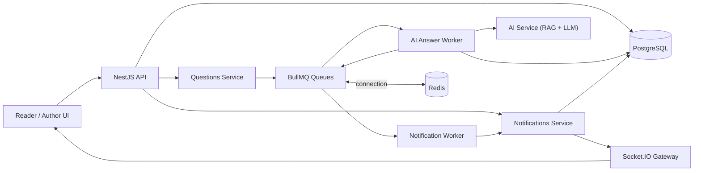
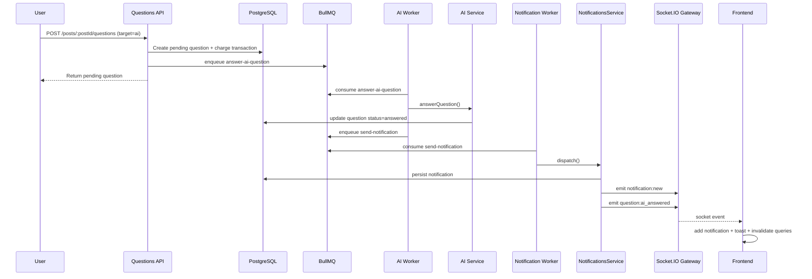
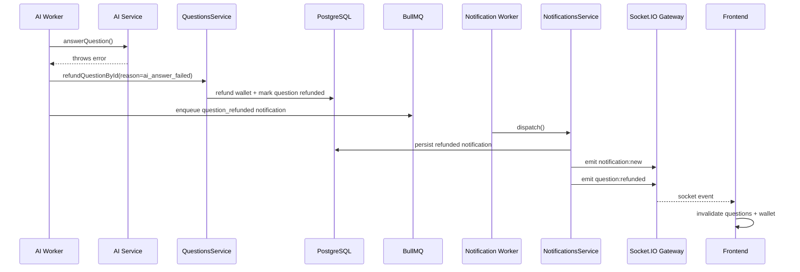

# System Design: Real-Time Notifications with Socket.IO and Background AI Answering via BullMQ + Redis

## 1. Mục tiêu

Thiết kế một kiến trúc cho phép hệ thống:

- xử lý các tác vụ AI tốn thời gian ở background,
- đẩy thông báo realtime đến đúng người dùng ngay khi có kết quả,
- đồng thời lưu bền thông báo để người dùng vẫn thấy lịch sử khi reload hoặc đang offline lúc event xảy ra.

Trong repo hiện tại, tính năng này kết hợp:

- `BullMQ + Redis` cho background processing,
- `Socket.IO` cho realtime delivery,
- `PostgreSQL` cho persistence của notification và trạng thái câu hỏi,
- `React Query + Zustand + socket.io-client` ở frontend để đồng bộ UI.

## 2. Use case chính

Trọng tâm của feature là luồng hỏi AI trong bài viết:

1. Người dùng gửi câu hỏi trả phí tới AI.
2. Backend ghi nhận question ở trạng thái `pending`.
3. Request HTTP trả về nhanh, không chờ model trả lời.
4. Background worker lấy job AI answer từ BullMQ.
5. Worker gọi AI service, cập nhật DB.
6. Worker enqueue notification job.
7. Notification worker lưu notification vào DB.
8. Notification gateway đẩy event realtime đến đúng room của user.
9. Frontend nhận socket event, cập nhật notification inbox, hiện toast và invalidate query liên quan.

Ngoài AI answering, kiến trúc này còn dùng được cho:

- câu hỏi tác giả đã trả lời,
- hoàn tiền câu hỏi AI lỗi,
- câu hỏi mới gửi cho tác giả,
- comment mới trên bài viết.

## 3. Mục tiêu thiết kế

- Không block request người dùng bởi latency của LLM.
- Đảm bảo notification vừa realtime vừa durable.
- Cho phép user reconnect mà không mất dữ liệu.
- Tách producer và consumer để scale độc lập.
- Giảm coupling giữa domain logic, queue logic và realtime transport.

## 4. Ngoài phạm vi

- Exactly-once delivery tuyệt đối.
- Cross-device push notification ngoài web socket, ví dụ APNs/FCM.
- Notification preference center theo từng loại event.
- Analytics chuyên sâu cho delivery/open rate.
- Distributed tracing end-to-end giữa HTTP, queue và socket.

## 5. Kiến trúc tổng quan

## 6. Thành phần chính trong repo

| Thành phần | Vai trò |
| --- | --- |
| `backend/src/jobs/job-queue.service.ts` | Tạo queue BullMQ, enqueue job, cấu hình Redis |
| `backend/src/jobs/ai-answer.processor.ts` | Worker xử lý job trả lời AI |
| `backend/src/jobs/notification.processor.ts` | Worker xử lý job gửi notification |
| `backend/src/modules/ai/ai.service.ts` | Sinh câu trả lời AI và cập nhật `QuestionEntity` |
| `backend/src/modules/questions/questions.service.ts` | Producer enqueue AI answer job và notification job |
| `backend/src/modules/notifications/notifications.service.ts` | Tạo notification, lưu DB, emit Socket.IO |
| `backend/src/modules/notifications/notifications.gateway.ts` | Xác thực socket, join room theo user, emit event realtime |
| `frontend/src/hooks/useSocket.ts` | Đăng ký event socket và sync lại cache/store |
| `frontend/src/stores/notificationStore.ts` | Lưu inbox local, unread count, persistence localStorage |
| `frontend/src/components/auth/SessionBootstrapper.tsx` | Load initial notifications từ REST khi user có session |

## 7. Lý do chọn kiến trúc này

### 7.1 Tách background khỏi request-response

AI answer có latency cao, có thể:

- phụ thuộc external API,
- bị timeout,
- thất bại bất chợt,
- cần retry hoặc refund.

Nếu để trong request synchronous:

- UX chậm,
- request timeout dễ xảy ra,
- khó scale web tier.

### 7.2 Tách persistence khỏi realtime transport

Chỉ đẩy socket không đủ, vì:

- user có thể đang offline,
- tab có thể reload,
- socket có thể reconnect sau khi event đã đi qua.

Vì vậy notification được:

1. lưu vào DB,
2. rồi mới emit realtime.

### 7.3 Dùng room theo user

Socket.IO room `user:{userId}` giúp:

- phát đúng tới toàn bộ tab/device của cùng một user,
- không cần giữ mapping socket thủ công phức tạp.

## 8. Queue topology

### 8.1 Queue names

Khai báo trong `job.constants.ts`:

- `embedding-queue`
- `ai-answer-queue`
- `refund-queue`
- `notification-queue`
- `payment-queue`

Trong feature này, quan trọng nhất là:

- `ai-answer-queue`
- `notification-queue`

### 8.2 Job names

- `answer-ai-question`
- `send-notification`

### 8.3 Retry và priority hiện tại

Từ `JobQueueService`:

- AI answer job:
  - `attempts: 1`
  - `priority: 2`
- Notification job:
  - `attempts: 2`
  - `priority: 10`

Mọi queue hiện dùng:

- `removeOnComplete: 100`
- `removeOnFail: 100`

### 8.4 Worker concurrency hiện tại

- AI answer worker: `concurrency = 2`
- Notification worker: `concurrency = 5`

Ý nghĩa:

- AI worker thấp hơn vì external AI calls đắt và chậm.
- Notification worker cao hơn vì công việc nhẹ hơn.

## 9. Redis layer

Redis được dùng làm broker và storage backend cho BullMQ.

### 9.1 Nguồn config

`redis.config.ts` hỗ trợ:

- `REDIS_URL`
- hoặc `REDIS_HOST`, `REDIS_PORT`, `REDIS_USERNAME`, `REDIS_PASSWORD`, `REDIS_TLS`

### 9.2 Kết nối BullMQ

`JobQueueService` tạo một connection options chung và reuse cho:

- queue producers,
- workers.

Thuộc tính đáng chú ý:

- `maxRetriesPerRequest: null`

Điều này phù hợp với BullMQ/ioredis để tránh hành vi retry request bất ngờ gây lỗi cho worker.

## 10. Realtime delivery model

### 10.1 Socket authentication

`NotificationsGateway` xác thực socket bằng JWT access token lấy từ:

- `client.handshake.auth.token`,
- hoặc `Authorization: Bearer ...` header.

Gateway sẽ:

1. verify JWT bằng `jwt.accessSecret`,
2. load user từ DB,
3. từ chối nếu user không tồn tại, đã bị ban, hoặc token cũ hơn `passwordChangedAt`,
4. join socket vào room `user:{userId}`.

### 10.2 Emit strategy

Gateway expose:

- `emitToUser(userId, event, payload)`

`NotificationsService` dùng gateway để emit:

- `notification:new`
- `comment:new`
- `question:answered`
- `question:ai_answered`
- `question:refunded`

### 10.3 Hybrid delivery

Mỗi notification domain event được xử lý theo hai lớp:

1. lưu notification vào bảng `notifications`,
2. emit event realtime qua Socket.IO.

Nếu socket miss event:

- user vẫn thấy notification qua REST fetch khi session bootstrap hoặc vào trang thông báo.

## 11. Notification persistence model

### 11.1 Bảng `notifications`

`NotificationEntity` lưu:

- `recipientId`
- `actorId`
- `type`
- `title`
- `message`
- `data`
- `isRead`
- `readAt`
- `createdAt`
- `updatedAt`

### 11.2 REST API cho inbox

`NotificationsController` expose:

- `GET /notifications`
- `PATCH /notifications/:id/read`
- `PATCH /notifications/read-all`

Backend trả tối đa `50` notification gần nhất cho mỗi user ở `listMine()`.

### 11.3 Frontend persistence

Frontend dùng `notificationStore` với `zustand/persist`:

- lưu notifications vào `localStorage`,
- giữ `unreadCount`,
- giới hạn local list ở `50` item.

Điều này tạo cảm giác inbox luôn có sẵn ngay cả trước khi query đầu tiên hoàn tất.

## 12. AI answer flow end-to-end

### 12.1 Create AI question

Khi user gọi API tạo câu hỏi tới AI:

1. `QuestionsService.create()` kiểm tra post và số dư ví.
2. Trong DB transaction:
   - trừ phí từ ví người hỏi,
   - cộng vào ví hệ thống,
   - tạo transaction `question_to_ai`,
   - tạo `QuestionEntity` trạng thái `pending`.
3. Sau transaction, service enqueue job AI answer.
4. HTTP response trả về ngay với question đang `pending`.

### 12.2 Worker xử lý AI

`AiAnswerProcessor` nhận job:

- `questionId`
- `postId`
- `content`
- `authorId`
- `askerId`

Worker gọi:

- `AiService.answerQuestion(questionId, postId, content, authorId)`

`AiService` sẽ:

1. load question,
2. bỏ qua nếu question không còn `pending`,
3. embed câu hỏi,
4. retrieval context từ post/document embeddings,
5. gọi LLM,
6. cập nhật:
   - `answer`
   - `answeredAt`
   - `status = answered`

### 12.3 Sau khi AI trả lời thành công

Worker enqueue notification job:

- `type = question_answered`
- `recipientId = askerId`
- payload gồm `questionId`, `postId`, `target = ai`

### 12.4 Nếu AI worker thất bại

Worker:

1. log error,
2. gọi `questionsService.refundQuestionById(questionId, 'ai_answer_failed')`,
3. enqueue notification:
   - `type = question_refunded`
   - payload chứa `reason = ai_answer_failed`

Điều này giúp user vừa được hoàn tiền, vừa thấy trạng thái cập nhật ngay.

## 13. Sequence diagram: success path

## 14. Sequence diagram: failure and refund path

## 15. Notification producer model

### 15.1 Queue-based producers

Các luồng dùng BullMQ trước khi gửi notification:

- AI answer success
- AI answer refund
- author answer question
- author receives new paid question

Trong `QuestionsService`, producer gọi:

- `jobQueueService.enqueueNotification(...)`

### 15.2 Direct dispatch producers

Comment mới hiện gọi trực tiếp:

- `notificationsService.dispatch(...)`

Điều này cho thấy kiến trúc hiện tại là hybrid:

- tác vụ nhẹ, synchronous có thể dispatch trực tiếp,
- tác vụ background hoặc domain đã async thì enqueue notification qua queue.

## 16. Notification content pipeline

`NotificationsService.dispatch()` thực hiện:

1. `createNotification(input)`
2. `buildNotificationContent(input)`
3. persist vào `notifications`
4. emit `notification:new`
5. emit thêm domain event chuyên biệt nếu cần

### 16.1 Notification types hiện có

- `comment_created`
- `question_created`
- `question_answered`
- `question_refunded`

### 16.2 Type mapping cho UI

Service map domain input thành type hiển thị như:

- `new_comment`
- `new_question`
- `question_answered`
- `question_refunded`
- fallback `system`

### 16.3 Domain event chuyên biệt

Ngoài inbox event tổng quát `notification:new`, service còn emit:

- `comment:new`
- `question:answered`
- `question:ai_answered`
- `question:refunded`

Điều này giúp frontend xử lý UI theo hai lớp:

1. cập nhật inbox,
2. invalidate query của domain liên quan.

## 17. Frontend consumption model

### 17.1 Bootstrap dữ liệu ban đầu

`SessionBootstrapper` chạy khi user có session:

- `authApi.getMe()`
- `walletApi.getWallet()`
- `notificationsApi.getMine()`

Sau đó ghi vào:

- `authStore`
- `walletStore`
- `notificationStore`

### 17.2 Socket provider

`SocketProvider` gọi `useSocket()`.

`useSocket()`:

1. chờ auth hydrated,
2. kết nối socket khi có `accessToken`,
3. gắn handler cho các event,
4. disconnect khi logout hoặc cleanup.

### 17.3 Event handlers hiện tại

- `notification:new`
  - add notification vào store
  - hiện toast
- `question:answered`
  - invalidate `["questions", postId]`
- `question:ai_answered`
  - invalidate `["questions", postId]`
- `question:refunded`
  - invalidate `["questions", postId]`
  - invalidate `["wallet"]`
- `comment:new`
  - invalidate `["comments", postId]`
- `wallet:balance_updated`
  - cập nhật balance nếu event tồn tại

### 17.4 UI behavior

`NotificationBell` đọc `unreadCount` từ store để hiển thị badge realtime.

`NotificationList`:

- hiển thị inbox trong panel hoặc page,
- cho phép mark all read,
- dùng dữ liệu store thay vì query trực tiếp mỗi lần render.

## 18. Event catalog

| Event | Phát từ backend | Mục đích |
| --- | --- | --- |
| `notification:new` | `NotificationsService` | Thêm item mới vào inbox |
| `question:answered` | `NotificationsService` | Refresh câu hỏi khi tác giả trả lời |
| `question:ai_answered` | `NotificationsService` | Refresh câu hỏi khi AI trả lời |
| `question:refunded` | `NotificationsService` | Refresh câu hỏi và ví sau refund |
| `comment:new` | `NotificationsService` | Refresh danh sách comment |
| `wallet:balance_updated` | chưa thấy backend emit trong code hiện tại | reserved/front-ready event |

## 19. Tính nhất quán và độ tin cậy

### 19.1 At-least-once ở queue layer

BullMQ cung cấp mô hình delivery thực tế gần với at-least-once:

- job có thể retry,
- worker cần viết logic idempotent hoặc safe-enough.

### 19.2 Durability của notification

Notification được lưu DB trước khi emit socket.

Nếu socket emit thất bại hoặc client offline:

- user vẫn lấy lại được qua REST.

### 19.3 UI eventual consistency

Frontend không chỉ dựa vào socket payload để patch sâu toàn bộ state.

Thay vào đó:

- inbox dùng push payload trực tiếp,
- dữ liệu domain như questions/comments/wallet chủ yếu dùng invalidation.

Đây là một chiến lược pragmatic vì:

- đơn giản hơn,
- ít bug merge state hơn,
- vẫn nhanh nhờ socket trigger.

## 20. Idempotency và guard logic

### 20.1 AI answer

`AiService.answerQuestion()` kiểm tra:

- nếu question không tồn tại -> throw
- nếu question không còn `pending` -> return question hiện tại

Guard này giúp giảm nguy cơ duplicate processing nếu worker chạy lại.

### 20.2 Refund path

`QuestionsService.refundQuestionById()` và refund logic bên trong kiểm tra trạng thái để tránh double refund.

### 20.3 Notification store

Frontend `addNotification()` loại bỏ item cùng `id` trước khi prepend lại.

Điều này giúp:

- hạn chế duplicate trong trường hợp server gửi lại cùng notification.

## 21. Hiệu năng và scale

### 21.1 Scale web tier

Web API có thể scale độc lập với AI worker vì request chỉ enqueue job rồi trả về.

### 21.2 Scale AI workers

Có thể tăng số worker process cho `ai-answer-queue` khi throughput tăng.

### 21.3 Scale notification workers

Notification worker nhẹ hơn nên có thể scale cao hơn AI worker.

### 21.4 Socket layer

Per-user room phù hợp cho multi-tab delivery, nhưng khi scale sang nhiều instance socket server:

- cần adapter chia sẻ state, thường là Redis adapter cho Socket.IO.

Code hiện tại chưa cho thấy adapter này được cấu hình.

## 22. Observability

### 22.1 Log nên có

- `questionId`
- `postId`
- `recipientId`
- `notificationType`
- `jobId`
- `queueName`
- `status before/after`
- `refundReason`
- `socket user room`

### 22.2 Metrics nên có

- queue depth cho `ai-answer-queue` và `notification-queue`
- AI job success/fail rate
- median AI answer latency
- notification dispatch latency
- socket connection count
- unread notification growth
- reconnect rate

## 23. Rủi ro hiện tại

### 23.1 Notification delivery không có ack application-level

Socket emit thành công ở server chưa đồng nghĩa client đã thực sự xử lý xong event.

Mitigation hiện tại:

- persist DB + bootstrap REST.

### 23.2 `wallet:balance_updated` đã có handler phía client nhưng chưa thấy backend emit

Điều này cho thấy event contract đã được chuẩn bị, nhưng backend chưa dùng hoặc dùng ở phần chưa thấy trong repo hiện tại.

### 23.3 Comment notification còn dispatch trực tiếp

Điều này ổn cho khối lượng nhỏ, nhưng khi volume tăng có thể muốn chuẩn hóa tất cả notification qua queue.

### 23.4 AI answer attempts đang là `1`

Không retry giúp tránh duplicate side effect, nhưng cũng làm giảm resilience nếu lỗi là tạm thời từ provider.

## 24. Các cải tiến nên làm tiếp

1. Chuẩn hóa mọi notification producer đi qua `notification-queue` để có cùng cơ chế retry/audit.
2. Thêm dead-letter strategy hoặc failed-job dashboard cho AI jobs.
3. Thêm Socket.IO Redis adapter nếu backend chạy nhiều instance.
4. Bổ sung correlation id xuyên suốt từ question create -> AI job -> notification job -> socket emit.
5. Xem xét retry có kiểm soát cho AI answer cùng idempotency key mạnh hơn.
6. Thêm `wallet:balance_updated` emit từ backend khi refund hoặc payout xong.
7. Thêm metrics và health endpoint cho queue backlog.
8. Tách notification payload schema rõ ràng hơn thay vì `type: string` + `payload: Record<string, unknown>`.

## 25. Current implementation notes

Đây là snapshot đúng với code hiện tại:

1. `AiAnswerProcessor` enqueue notification sau khi AI trả lời xong hoặc refund xong.
2. `NotificationProcessor` mới là nơi tiêu thụ `send-notification` job và gọi `NotificationsService.dispatch()`.
3. `NotificationsService.dispatch()` vừa persist DB vừa emit socket.
4. `NotificationsGateway` join room theo `user:{userId}` sau khi verify JWT.
5. `SessionBootstrapper` load notification history qua REST ngay khi session hợp lệ.
6. Frontend nhận `notification:new` để cập nhật inbox và toast, đồng thời nhận domain event riêng để invalidate query.
7. Comment notifications hiện bypass queue và dispatch trực tiếp.

## 26. Mapping với codebase hiện tại

Các file chính:

- `backend/src/jobs/job-queue.service.ts`
- `backend/src/jobs/job.constants.ts`
- `backend/src/jobs/ai-answer.processor.ts`
- `backend/src/jobs/notification.processor.ts`
- `backend/src/modules/ai/ai.service.ts`
- `backend/src/modules/questions/questions.service.ts`
- `backend/src/modules/notifications/notifications.gateway.ts`
- `backend/src/modules/notifications/notifications.service.ts`
- `backend/src/modules/notifications/notifications.controller.ts`
- `backend/src/modules/notifications/entities/notification.entity.ts`
- `backend/src/config/redis.config.ts`
- `frontend/src/services/socket/socketClient.ts`
- `frontend/src/services/socket/events.ts`
- `frontend/src/hooks/useSocket.ts`
- `frontend/src/components/providers/SocketProvider.tsx`
- `frontend/src/components/auth/SessionBootstrapper.tsx`
- `frontend/src/stores/notificationStore.ts`
- `frontend/src/components/notifications/NotificationBell.tsx`
- `frontend/src/components/notifications/NotificationList.tsx`

## 27. Kết luận

Kiến trúc hiện tại của repo là một mô hình hợp lý cho realtime product features có AI:

- tác vụ AI chạy nền qua `BullMQ + Redis`,
- notification được lưu bền trong DB,
- Socket.IO dùng để phát delta realtime theo room user,
- frontend dùng hybrid model giữa bootstrap REST, local store và query invalidation.

Đây là một thiết kế thực dụng và đúng hướng vì nó cân bằng được:

- tốc độ phản hồi API,
- độ bền dữ liệu,
- realtime UX,
- và khả năng mở rộng từng phần của hệ thống một cách độc lập.
