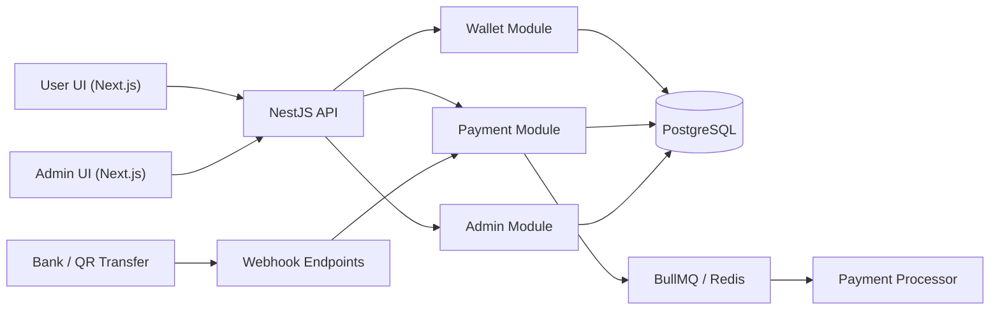
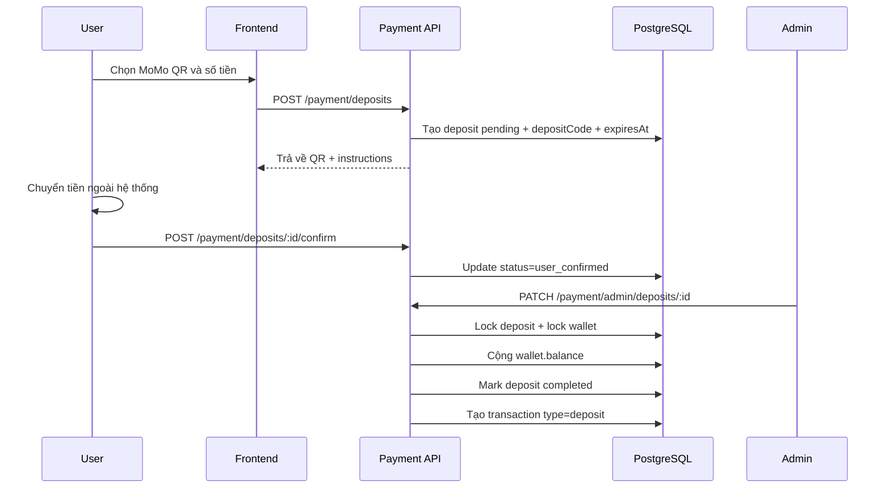
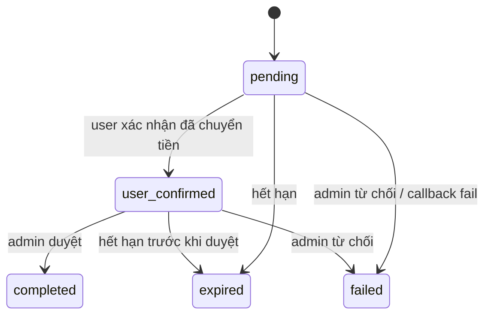
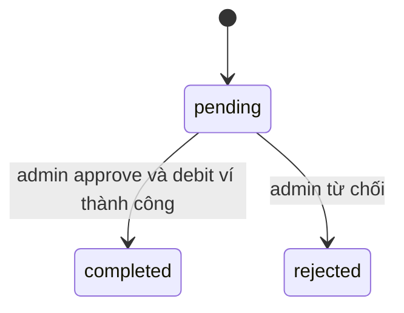

# System Design: Internal Wallet Balance Management, Deposits, and Withdrawals

## 1. Mục tiêu

Thiết kế một hệ thống ví nội bộ cho phép:

- lưu trữ số dư khả dụng của người dùng trong nền tảng,
- nạp tiền vào ví qua nhiều phương thức thanh toán,
- rút tiền từ ví về tài khoản ngân hàng,
- ghi nhận đầy đủ lịch sử giao dịch để các feature trả phí khác có thể tái sử dụng.

Tài liệu này bám theo codebase hiện tại của repo, đồng thời chỉ ra các điểm nên cải tiến để ví nội bộ an toàn hơn khi scale.

## 2. Mục tiêu sản phẩm

- Cho phép user nạp tiền nhanh để dùng cho các tính năng premium.
- Tạo một lớp thanh toán nội bộ tách khỏi payment gateway thời gian thực.
- Hỗ trợ admin kiểm soát các luồng cần duyệt thủ công.
- Đảm bảo có thể audit được mọi biến động số dư.
- Giảm rủi ro cộng tiền trùng, rút tiền trùng hoặc sai lệch sổ cái.

## 3. Phạm vi

### Trong phạm vi

- Quản lý số dư ví nội bộ của user.
- Nạp tiền bằng QR/manual review và auto-match qua webhook ngân hàng.
- Rút tiền về tài khoản ngân hàng thông qua quy trình admin duyệt.
- Ghi transaction cho deposit và withdrawal.
- Expose API để frontend hiển thị ví, lịch sử giao dịch, lịch sử deposit và withdrawal.

### Ngoài phạm vi hiện tại

- Chuyển tiền P2P giữa user với user.
- Multi-currency.
- KYC/AML nâng cao.
- Tích hợp payout tự động với ngân hàng trong bước withdrawal.
- Ledger chuẩn kế toán double-entry hoàn chỉnh.

## 4. Bối cảnh hiện tại trong repo

Repo hiện có hai lớp liên quan:

- `WalletModule`: quản lý wallet summary, transaction history, tạo withdrawal request, và còn giữ một deposit API cũ.
- `PaymentModule`: quản lý deposit flow mới, bao gồm QR, webhook, expire và admin review.

### Nhận xét quan trọng

1. Frontend hiện dùng `PaymentModule` cho deposit.
2. Frontend vẫn dùng `WalletModule` cho wallet overview, transaction history và withdrawal request.
3. Có deposit API cũ ở `POST /wallet/deposit` dùng `vnpay`/`momo`, nhưng UI hiện không sử dụng.
4. Withdrawal hiện tạo request `pending`, nhưng không giữ chỗ số dư tại thời điểm request.

Điểm số 4 là rủi ro hệ thống lớn nhất của flow hiện tại.

## 5. Kiến trúc tổng quan



## 6. Thành phần chính

| Thành phần | Vai trò |
| --- | --- |
| `backend/src/modules/wallet/*` | Wallet summary, transactions, withdrawal request |
| `backend/src/modules/payment/*` | Deposit orchestration, QR generation, webhook matching, admin review |
| `backend/src/modules/admin/*` | Duyệt hoặc từ chối withdrawal |
| `backend/src/jobs/payment.processor.ts` | Xử lý callback queue và job hết hạn deposit |
| `frontend/src/components/wallet/DepositForm.tsx` | UI deposit flow đang dùng |
| `frontend/src/components/wallet/WithdrawForm.tsx` | UI withdrawal request |
| `frontend/src/services/api/payment.api.ts` | Client cho deposit flow mới |
| `frontend/src/services/api/wallet.api.ts` | Client cho wallet overview, transactions, withdrawal |

## 7. Domain model hiện tại

### 7.1 `WalletEntity`

Đại diện cho ví nội bộ của mỗi user.

Field chính:

- `userId`
- `balance`
- `totalEarned`
- `totalSpent`

### 7.2 `TransactionEntity`

Sổ cái giao dịch mức ứng dụng, dùng để audit và hiển thị lịch sử.

Các loại transaction liên quan ví:

- `deposit`
- `withdrawal`
- `withdrawal_fee`
- ngoài ra còn có `question_to_author`, `question_to_ai`, `refund`, `bonus`

### 7.3 `DepositEntity`

Quản lý từng yêu cầu nạp tiền.

Field đáng chú ý:

- `amount`
- `depositCode`
- `paymentMethod`
- `paymentRef`
- `status`
- `expiresAt`
- `matchedAt`
- `userConfirmedAt`
- `transferProofUrl`
- `adminConfirmedBy`
- `adminNote`
- `webhookData`
- `completedAt`

### 7.4 `WithdrawalEntity`

Quản lý từng yêu cầu rút tiền.

Field đáng chú ý:

- `amount`
- `feeAmount`
- `bankName`
- `bankAccount`
- `bankHolder`
- `status`
- `approvedBy`
- `completedAt`

### 7.5 Ví hệ thống

Repo hiện có khái niệm `platform system wallet` được tạo qua `WalletService.ensurePlatformSystemWallet()`.

Ví này hiện chủ yếu được dùng cho:

- thu/phát sinh doanh thu trong feature khác như paid questions,
- nhận `withdrawal_fee` nếu có.

Hiện deposit không cộng đối ứng vào ví hệ thống; transaction deposit được ghi với `senderId = null`.

## 8. Mô hình số dư hiện tại

### 8.1 Những gì đang có

Số dư user hiện được mô hình hóa bằng một field:

- `wallet.balance`

Các field phụ:

- `totalEarned`
- `totalSpent`

### 8.2 Ý nghĩa thực tế hiện tại

- `balance`: số dư khả dụng để user chi tiêu hoặc yêu cầu rút.
- `totalEarned`: thống kê tiền user đã kiếm được.
- `totalSpent`: thống kê tiền user đã chi hoặc bị trừ.

### 8.3 Giới hạn của mô hình này

Mô hình này đủ cho:

- cộng tiền sau deposit,
- trừ tiền khi settle một giao dịch ngay lập tức,
- hiển thị số dư đơn giản.

Mô hình này chưa đủ tốt cho:

- giữ chỗ tiền cho withdrawal đang chờ xử lý,
- phân biệt tiền khả dụng và tiền bị hold,
- reconciliation cấp kế toán,
- chống oversubscription khi có nhiều withdrawal pending.

## 9. Nguyên tắc thiết kế nên áp dụng

1. Mọi thay đổi số dư phải đi kèm transaction log.
2. Deposit chỉ được credit đúng một lần.
3. Withdrawal chỉ được debit đúng một lần.
4. Mọi callback/webhook phải idempotent.
5. Các thao tác cập nhật tiền phải dùng DB transaction và row-level lock.
6. Cần phân biệt trạng thái business entity với trạng thái money movement.

## 10. Luồng deposit hiện tại

Repo đang có ba luồng deposit:

1. Deposit mới qua `PaymentModule` bằng `momo_qr`.
2. Deposit mới qua `PaymentModule` bằng `vcb_qr` hoặc `ocb_qr`.
3. Deposit cũ qua `WalletModule` bằng `vnpay` hoặc `momo`.

Flow đang được frontend sử dụng là số 1 và số 2.

## 11. Deposit flow qua QR/manual review

### 11.1 Create deposit

User gọi:

- `POST /payment/deposits`

Hệ thống:

1. expire các deposit cũ quá hạn của user,
2. xác định payment method,
3. validate số tiền theo min/max/allowed amounts,
4. kiểm tra user đã có deposit active cùng method chưa,
5. nếu đã có thì refresh QR và trả lại deposit cũ,
6. nếu chưa có thì tạo deposit mới,
7. sinh `depositCode` duy nhất,
8. tạo QR payload và image,
9. set `status = pending`,
10. set `expiresAt`,
11. enqueue job hết hạn deposit.

### 11.2 Lý do dùng `depositCode`

`depositCode` là khóa đối soát giữa transfer thực tế và deposit request trong hệ thống.

Vai trò:

- giúp match webhook ngân hàng với đúng deposit record,
- tránh nhầm lẫn giữa nhiều khoản nạp cùng số tiền,
- cho phép dùng QR tĩnh hoặc QR theo template nhưng vẫn đối soát chính xác qua nội dung chuyển khoản.

## 12. Deposit flow manual với `momo_qr`



### 12.1 State machine hiện tại của deposit manual



## 13. Deposit flow auto-confirm qua bank QR/webhook

Đây là flow tốt hơn về mặt vận hành vì không cần admin duyệt nếu webhook match thành công.

### 13.1 Create bank QR deposit

User gọi:

- `POST /payment/deposits` với `paymentMethod = vcb_qr | ocb_qr`

Hệ thống:

1. validate config ngân hàng,
2. validate amount,
3. tạo deposit pending,
4. sinh `depositCode`,
5. tạo VietQR image URL,
6. set `expiresAt`,
7. enqueue expire job.

### 13.2 Webhook reconciliation

Bank provider gửi webhook tới:

- `POST /payment/webhook/casso`
- `POST /payment/webhook/sepay`

Hệ thống:

1. verify secret/API key,
2. normalize danh sách transaction từ webhook,
3. trích `depositCode` từ `paymentCode` hoặc `description`,
4. tìm deposit pending phù hợp,
5. kiểm tra expire,
6. tính `creditedAmount`,
7. dùng DB transaction để:
   - lock deposit,
   - lock wallet,
   - cộng `wallet.balance`,
   - mark deposit `completed`,
   - ghi `matchedAt`, `paymentRef`, `webhookData`,
   - tạo transaction `deposit`.

### 13.3 Idempotency hiện tại

Idempotency dựa trên:

- chỉ xử lý deposit đang `pending`,
- lock deposit bằng `pessimistic_write`,
- sau khi completed thì callback lặp lại sẽ không match nhánh cập nhật nữa.

Thiết kế này đủ dùng ở mức cơ bản, nhưng vẫn nên bổ sung unique guard với `paymentRef` hoặc `bankTransactionId`.

## 14. Deposit flow callback cũ qua `vnpay` / `momo`

Repo vẫn giữ:

- `POST /wallet/deposit`
- `POST /payment/vnpay/callback`
- `POST /payment/momo/callback`

Flow này:

1. tạo deposit với `paymentRef`,
2. redirect tới payment URL,
3. callback về backend,
4. nếu thành công thì lock wallet và cộng `balance`,
5. mark deposit completed,
6. tạo transaction `deposit`.

### 14.1 Trạng thái của flow này

- vẫn tồn tại trong backend,
- frontend deposit screen hiện không dùng,
- nên xem là flow legacy hoặc backup flow.

Khuyến nghị:

- chọn một deposit API canonical duy nhất,
- hoặc xóa flow cũ khỏi public surface nếu không còn dùng.

## 15. Deposit expiration

Deposit có thể hết hạn theo hai cơ chế:

1. eager expiration khi user query danh sách/status hoặc tạo deposit mới,
2. async expiration qua job queue `expireDeposit`.

### Ưu điểm

- không cần cron toàn cục phức tạp,
- vẫn giữ được eventual consistency khi user không quay lại UI,
- đơn giản hóa vòng đời QR.

### Lưu ý

Job hết hạn chỉ nên đổi trạng thái business entity, không làm động tới wallet balance vì deposit chưa được credit trước đó.

## 16. Withdrawal flow hiện tại

### 16.1 Create withdrawal request

User gọi:

- `POST /wallet/withdraw`

Hệ thống:

1. đọc wallet hiện tại,
2. check `wallet.balance >= amount`,
3. tạo `WithdrawalEntity` với:
   - `status = pending`
   - `feeAmount = 0`
   - thông tin ngân hàng,
4. chưa trừ tiền khỏi wallet.

### 16.2 Approve withdrawal

Admin gọi:

- `PATCH /admin/withdrawals/:id/approve`

Hệ thống dùng DB transaction:

1. lock withdrawal,
2. check `status = pending`,
3. lock wallet user,
4. tính `totalDebit = amount + feeAmount`,
5. check balance đủ tại thời điểm approve,
6. trừ `wallet.balance`,
7. tăng `wallet.totalSpent`,
8. mark withdrawal `completed`,
9. tạo transaction `withdrawal`,
10. nếu có `feeAmount > 0`:
    - cộng fee vào ví hệ thống,
    - tăng `systemWallet.totalEarned`,
    - tạo transaction `withdrawal_fee`.

### 16.3 Reject withdrawal

Admin gọi:

- `PATCH /admin/withdrawals/:id/reject`

Hệ thống:

1. check `status = pending`,
2. set `status = rejected`,
3. set `approvedBy`,
4. set `completedAt`.

Không có thay đổi số dư vì tiền chưa từng bị giữ hoặc trừ trước đó.

## 17. State machine hiện tại của withdrawal



### Nhận xét quan trọng

Enum hiện có:

- `pending`
- `approved`
- `rejected`
- `completed`

Nhưng code hiện tại không dùng trạng thái `approved`; admin approve đi thẳng sang `completed`.

Điều này tạo ra sự lệch nhẹ giữa model và implementation.

## 18. Vấn đề thiết kế lớn nhất của withdrawal hiện tại

### 18.1 Không có reservation/hold balance

Tại thời điểm user tạo withdrawal:

- hệ thống chỉ kiểm tra balance,
- nhưng không giữ tiền.

Hệ quả:

1. User có thể tạo nhiều withdrawal `pending` vượt quá số dư thực.
2. User có thể tạo withdrawal rồi tiếp tục tiêu số dư đó vào feature khác.
3. Đến lúc admin approve, request cũ có thể fail vì balance không còn đủ.
4. Admin queue không phản ánh đúng “nghĩa vụ phải trả” của hệ thống.

### 18.2 Hậu quả vận hành

- trải nghiệm admin xấu vì approve bị lỗi muộn,
- khó dự báo liquidity requirement,
- user thấy đã gửi yêu cầu rút nhưng thực tế tiền chưa được reserve,
- reconciliation cuối ngày khó hơn.

## 19. Thiết kế mục tiêu nên áp dụng cho withdrawal

### 19.1 Tách `available_balance` và `held_balance`

Khuyến nghị dùng một trong hai hướng:

1. Giữ `wallets` là summary table nhưng thêm nhiều bucket.
2. Chuyển sang ledger account model đầy đủ và derive balance từ ledger.

### 19.2 Tối thiểu nên có

Nếu muốn thay đổi ít:

- `available_balance`
- `held_balance`
- `total_earned`
- `total_spent`

Flow mới:

1. User tạo withdrawal.
2. Hệ thống lock wallet.
3. Trừ `available_balance`.
4. Cộng `held_balance`.
5. Tạo withdrawal `requested`.
6. Khi admin approve và payout thành công:
   - trừ `held_balance`,
   - mark withdrawal `completed`,
   - tạo transaction settlement.
7. Khi admin reject:
   - trả tiền từ `held_balance` về `available_balance`,
   - mark withdrawal `rejected`.

## 20. Ledger model khuyến nghị dài hạn

Để hệ thống an toàn hơn khi số lượng giao dịch tăng, nên chuyển dần sang double-entry ledger.

### 20.1 Các account logic

- `user_available`
- `user_held_withdrawal`
- `platform_settlement_clearing`
- `platform_fee_revenue`
- `external_bank_in`
- `external_bank_out`

### 20.2 Ví dụ entry

#### Deposit completed

- debit `external_bank_in`
- credit `user_available`

#### Withdrawal requested

- debit `user_available`
- credit `user_held_withdrawal`

#### Withdrawal completed

- debit `user_held_withdrawal`
- credit `external_bank_out`

#### Withdrawal fee

- debit `user_held_withdrawal` hoặc `user_available`
- credit `platform_fee_revenue`

Ưu điểm:

- audit tốt hơn,
- dễ reconciliation,
- dễ thêm nhiều feature tài chính mà không phá mô hình cũ.

## 21. Thiết kế trạng thái đề xuất

### 21.1 Deposit

Khuyến nghị:

```text
created -> pending_payment -> user_confirmed|matched -> processing -> completed
created|pending_payment|user_confirmed -> expired
matched|processing -> failed
```

Trong code hiện tại có thể giữ đơn giản, nhưng nên chuẩn bị chỗ cho `processing` nếu sau này tích hợp bank operator hoặc payout partner phức tạp hơn.

### 21.2 Withdrawal

Khuyến nghị:

```text
requested -> reserved -> processing -> completed
requested|reserved -> rejected
processing -> failed
```

Nếu muốn ít thay đổi hơn:

- `pending_review`
- `reserved`
- `completed`
- `rejected`
- `failed`

## 22. Invariants hệ thống nên bảo toàn

1. `wallet balance` hoặc `available_balance` không bao giờ âm.
2. Một deposit completed chỉ được credit ví đúng một lần.
3. Một withdrawal completed chỉ được debit ví đúng một lần.
4. Một withdrawal rejected không được tạo transaction `withdrawal`.
5. Mọi transaction tiền phải có `referenceId` và `referenceType`.
6. Callback lặp lại không được tạo thêm credit.
7. Admin approve lặp lại không được tạo thêm debit.

## 23. API contract hiện tại

### Wallet APIs

- `GET /wallet`
- `GET /wallet/transactions`
- `POST /wallet/withdraw`
- `GET /wallet/earnings`

### Deposit APIs mới

- `GET /payment/methods`
- `POST /payment/deposits`
- `GET /payment/deposits`
- `GET /payment/deposits/:id/status`
- `POST /payment/deposits/:id/confirm`

### Admin APIs

- `GET /payment/admin/deposits/pending`
- `PATCH /payment/admin/deposits/:id`
- `GET /admin/withdrawals`
- `PATCH /admin/withdrawals/:id/approve`
- `PATCH /admin/withdrawals/:id/reject`

### Webhook APIs

- `POST /payment/webhook/casso`
- `POST /payment/webhook/sepay`
- `POST /payment/vnpay/callback`
- `POST /payment/momo/callback`

## 24. Bảo mật và chống gian lận

### Deposit

- verify webhook secret trước khi xử lý.
- match deposit theo `depositCode`.
- giới hạn amount theo whitelist/preset.
- expire QR để giảm reuse.
- với manual review, lưu proof image URL và admin note.

### Withdrawal

- yêu cầu auth đầy đủ.
- validate số tài khoản/ngân hàng/chủ tài khoản.
- nên thêm velocity limit theo ngày.
- nên thêm risk checks cho account mới hoặc tài khoản vừa đổi bank info.
- nên log admin action chi tiết khi approve/reject.

## 25. Observability và vận hành

### Metrics nên có

- số deposit tạo mới theo method.
- success rate theo method.
- deposit expiration rate.
- webhook match rate.
- số withdrawal pending/completed/rejected.
- thời gian từ create withdrawal tới complete.
- số lần approve withdrawal fail do thiếu balance.
- chênh lệch tổng ledger với summary balance.

### Logs nên có

- `depositId`
- `withdrawalId`
- `transactionId`
- `userId`
- `paymentMethod`
- `paymentRef`
- `depositCode`
- `adminId`
- `oldStatus`
- `newStatus`
- `creditedAmount`
- `totalDebit`

### Reconciliation jobs nên có thêm

- đối chiếu deposit completed với bank webhook records.
- đối chiếu withdrawal completed với payout records ngoài hệ thống.
- cảnh báo nếu có transaction nhưng wallet summary không khớp.

## 26. Indexes và ràng buộc DB nên có

### Hữu ích cho deposit

- `deposits(user_id, created_at desc)`
- `deposits(status, expires_at)`
- `deposits(deposit_code)`
- unique mềm hoặc cứng cho `payment_ref` khi phù hợp

### Hữu ích cho withdrawal

- `withdrawals(user_id, created_at desc)`
- `withdrawals(status, created_at desc)`
- `withdrawals(approved_by)`

### Hữu ích cho transaction

- `transactions(receiver_id, created_at desc)`
- `transactions(sender_id, created_at desc)`
- `transactions(reference_type, reference_id)`

## 27. Các điểm technical debt hiện tại

1. Có hai deposit API song song: `wallet` cũ và `payment` mới.
2. `WithdrawalStatus` có `approved` nhưng implementation không dùng.
3. Withdrawal không reserve balance tại thời điểm request.
4. Deposit transaction hiện không có đối ứng nội bộ rõ ràng với một settlement account.
5. Hệ thống chưa có double-entry ledger thật sự.
6. Fee path cho withdrawal đã có shape nhưng hiện `feeAmount` luôn bằng `0` ở bước create request.

## 28. Đề xuất roadmap thực tế

### Giai đoạn 1

- Chọn `PaymentModule` làm deposit API canonical.
- Đánh dấu `wallet/deposit` là legacy hoặc xóa khỏi UI/API public.
- Bổ sung idempotency key cho create deposit và webhook processing.
- Thêm unique guard cho bank transaction reference.

### Giai đoạn 2

- Thêm `held_balance` hoặc `pending_withdrawal_balance`.
- Đổi flow withdrawal sang reserve tiền ngay lúc request.
- Tách trạng thái withdrawal rõ hơn: `pending_review`, `reserved`, `completed`, `rejected`.

### Giai đoạn 3

- Chuyển transaction sang ledger entry model.
- Thêm reconciliation job hằng ngày.
- Tích hợp payout provider cho withdrawal auto/semiauto.

## 29. Mapping với codebase hiện tại

Các file chính:

- `backend/src/modules/wallet/wallet.service.ts`
- `backend/src/modules/wallet/wallet.controller.ts`
- `backend/src/modules/payment/payment.service.ts`
- `backend/src/modules/payment/payment.controller.ts`
- `backend/src/modules/admin/admin.service.ts`
- `backend/src/modules/admin/admin.controller.ts`
- `backend/src/modules/wallet/entities/wallet.entity.ts`
- `backend/src/modules/wallet/entities/deposit.entity.ts`
- `backend/src/modules/wallet/entities/withdrawal.entity.ts`
- `backend/src/modules/wallet/entities/transaction.entity.ts`
- `backend/src/jobs/payment.processor.ts`
- `frontend/src/components/wallet/DepositForm.tsx`
- `frontend/src/components/wallet/WithdrawForm.tsx`
- `frontend/src/services/api/payment.api.ts`
- `frontend/src/services/api/wallet.api.ts`

## 30. Kết luận

Thiết kế ví nội bộ hiện tại của repo đã có nền tảng khá tốt cho giai đoạn đầu:

- có wallet summary,
- có transaction log,
- có deposit flow manual và auto,
- có queue cho webhook/expire,
- có admin flow cho withdrawal.

Điểm cần ưu tiên nâng cấp là withdrawal reservation. Nếu không giải quyết phần này, hệ thống sẽ luôn có rủi ro user tạo lệnh rút vượt khả năng chi trả thực tế tại thời điểm admin xử lý.

Thiết kế hợp lý nhất cho giai đoạn tiếp theo là:

- hợp nhất deposit surface,
- reserve balance ngay khi tạo withdrawal,
- tăng cường idempotency cho callback,
- sau đó tiến dần sang ledger-based accounting thay vì chỉ dựa vào summary balance.
